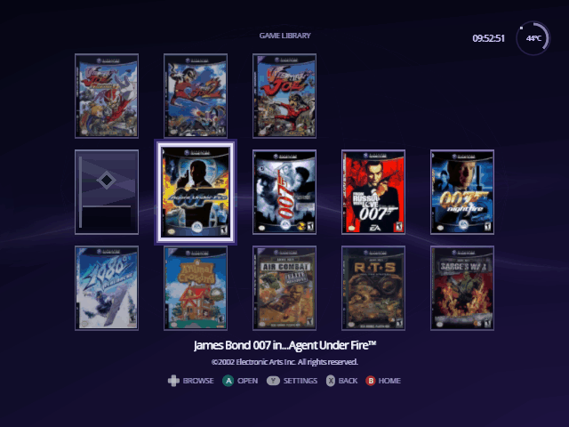
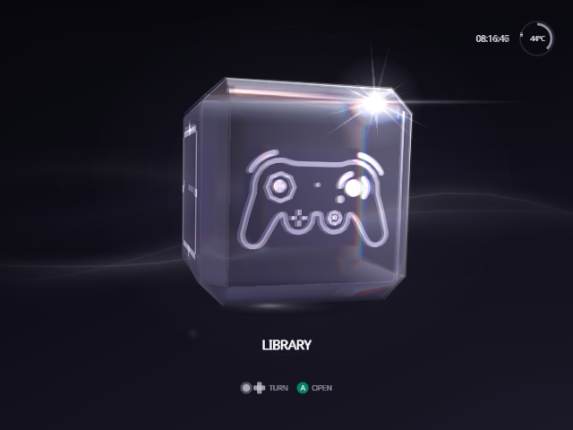
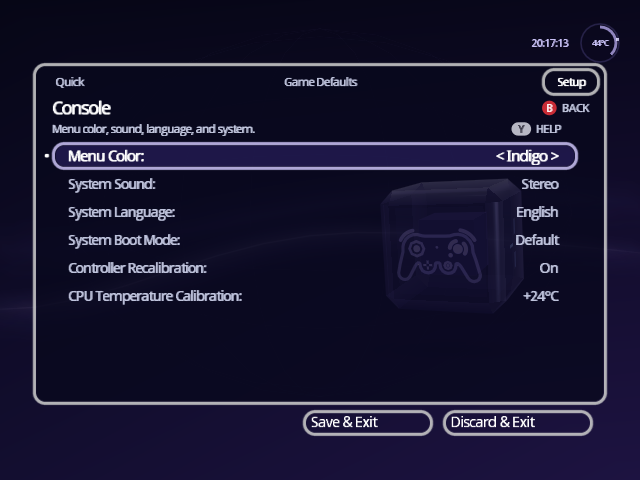

<h1 align="center">Indigo</h1>

<p align="center">
  <strong>A fork of Swiss for the Nintendo GameCube with the interface rebuilt.</strong><br>
  An animated Home, a poster library and game details, drawn in the console's own visual language.
</p>

<p align="center">
  <a href="https://norvitech.com"></a>
  <a href="https://github.com/spencercnorton/indigo/tags"></a>
  <a href="https://github.com/spencercnorton/indigo/releases/latest"></a>
  <a href="LICENSE"></a>
  <a href="https://buy.stripe.com/8x26oH2U44f65TRe574wM04"></a>
</p>

<p align="center">
  
</p>

Captured in the Dolphin emulator. The library and game detail pictures show a real poster pack and cheat file in use; box art belongs to its publishers.

**New to Indigo?** The [Indigo guide](docs/guide/README.md) walks through every screen and setting, with pictures.

Indigo is an unofficial fork of [Swiss](https://github.com/emukidid/swiss-gc),
the homebrew utility that boots and patches games on a Nintendo GameCube. The
fork changes one thing: what you look at. Everything underneath — the device
handlers, the patch engine, the loader — is upstream's work, and this fork
does not try to improve it. It is for people who use Swiss daily on real
hardware and want it to feel like it belongs on the console.

## What it does

**Home is an animated cube.** Four faces, one destination each: left and
right turn it sideways, up and down tip it over. It is glass, like the
GameCube's own menu, and it treats light the way glass does. Through the front
you see the cube's far edges and its inner cube, bent and slightly magnified,
and the rounded edges part the light into colour like a prism. Highlights and
the face icons glow, a fine rim lights the edges that face the light, and a
corner that catches the light glints like the sun. While Home rests, a band of
light passes over the glass every few seconds. Each face carries its own
emblem, and only the face you are on is named, under the cube. The Library face is a GameCube
controller that mirrors yours: its sticks lean with your sticks and its
buttons light as you press them, and when you leave it alone it plays by
itself. The GameCube's own interface language — the idle cube, the typeface,
the palette — is the reference, not a desktop launcher.

**The library retains its posters.** A grid over whatever device you booted
from, with artwork kept across navigation rather than re-read per frame, and
your selection restored when you come back from a game's details. Lay it
out as a carousel, a column with the title beside the cover, or a grid five
covers wide (Setup › Library › Library Layout); Y on a cover opens that
game's own settings. Cover art comes from a pack you build yourself (see
[Posters](#posters)); without one, each game gets a generated card.

<p align="center">
  
</p>

**Game details are a surface, not a dialogue.** Artwork, last played, save
data, cheats and the boot options for that title in one place, with the same
controller grammar as every other screen.

<p align="center">
  
</p>

**Cheats read clearly.** The cheat browser shows per-cheat state plainly, and
the runtime handling around it is stricter about what it will apply.

**Settings opens on what you change between games**, and reads like the
cheat browser: cards with ON and OFF switches, a line that says what the
highlighted setting does, and the buttons that work shown as icons. Quick
settings fit on one screen: menu music and sounds, In-Game Reset, memory-card
emulation, auto-loaded cheats and a few more. R moves to Game Defaults, what every game
starts with, and to Setup, which holds video, console, storage, network,
library and developer options in six sections. X on a game's detail screen,
or Y on its cover in the Library, opens that game's own settings, where
anything that differs from Game Defaults is marked Custom and X puts it back.
Holding the D-pad scrolls, A changes a value
(or, for a setting with many choices, lists them all), and B leaves and keeps
your changes. A new video mode only stays if you press
A within ten seconds. Settings can also be written ahead of time in a file on
the SD card: see [docs/SETTINGS.md](docs/SETTINGS.md). Setup › Storage says
whether that file loaded.

<p align="center">
  
</p>

<p align="center">
  
</p>

**Indigo comes in eight colors.** Setup › Console › Menu Color recolors the
cube, its light, the panels and the text: Indigo, the default, or Azure,
Emerald, Gold, Spice, Crimson, Rose or Jet Black. Every color keeps Indigo's
brightness, and cover art, the button icons, warnings and enabled cheats keep
their own colors.

<p align="center">
  
</p>

A on Menu Color lists the colors, and the whole screen takes each one as you
move through the list. B keeps the color you had; A chooses the one you are on.

<p align="center">
  
</p>

**Each face of the cube shows the picture you choose.** Setup › Console has a
row per face (Library Icon, Source Icon, Settings Icon and System Icon), each
with Controller, Books, Hub, Disc, Sliders, Gear, Clock or None.

## Install

### Download

Each [release](https://github.com/spencercnorton/indigo/releases/latest) has
an `Indigo-vX.Y.Z.zip`. Its `SD card` folder holds everything that goes on
the card:

```text
SD card/
├── ipl.dol      Indigo; PicoBoot and other modchips boot this
├── games/       your games (see Set up your library)
└── swiss/ui/    posters.pak, if you add one (see Posters)
```

If your card already has an `ipl.dol` in its root, that is your current
Swiss: rename it to `z.dol` first (holding Z at power-on starts it). Then copy
the contents of `SD card` to the root of the card. With GC Loader or another
loader that boots a disc image, start `ipl.dol` from Swiss instead.

### Any platform — from source

The build runs in the same container image the project's CI uses, so no
toolchain is installed on your machine:

```bash
git clone https://github.com/spencercnorton/indigo.git
cd indigo
docker run --rm -u "$(id -u):$(id -g)" -v "$PWD:/work" -w /work \
  ghcr.io/extremscorner/libogc2 make dev
# writes cube/swiss/swiss.dol inside this folder, on your computer
```

The download above is this build at the release tag, packaged by
`buildtools/sd_package.sh`.

The release packaging targets (`make dist` and friends) are not supported
here: they need prebuilt tools and device firmware images that this fork does
not redistribute. `make dev` builds the executable, which is what the fork
changes.

### On the console

`cube/swiss/swiss.dol` is where the build leaves the file, not a path on your
SD card. On the card, Indigo takes the place of the file your loader already
boots, under that file's name. Your Swiss settings carry over.

- **PicoBoot** boots `ipl.dol` from the root of the card. Rename that file to
  `z.dol`, then copy `swiss.dol` to the root as `ipl.dol`. PicoBoot starts
  `z.dol` when Z is held at power-on, so stock Swiss stays one button away.
- **PicoBoot with no `ipl.dol` on the card** has Swiss flashed onto the Pico
  itself. Flash PicoBoot's standard firmware (see its
  [installation guide](https://support.webhdx.dev/gc/picoboot/installation-guide)),
  then do the step above.
- **Another loader that boots a `.dol` from the card by name**: replace that
  file the same way, keeping its name.
- **GC Loader, and other loaders that boot a disc image**: start `swiss.dol`
  from Swiss's file browser. This fork does not build `boot.iso` or the other
  packaged formats.

With In-Game Reset set to **Apploader**, a reset returns to the Swiss inside
`/swiss/patches/apploader.img`, not to Indigo; `make dev` does not rebuild
that file.

## Set up your library

### Games

The Library shows the games in one folder, `/games` at the root of the card.
Put each game in its own folder or put the disc images there directly, and
keep nothing else in that folder:

```text
/games/Super Mario Sunshine [GMSE01]/game.iso
/games/Super Mario Sunshine.iso
```

Disc images end in `.iso`, `.gcm`, `.tgc` or `.fdi`. Any other file in
`/games` (a text file, a cover image, an empty folder) turns the Library back
into Swiss's plain file list; "Hide unknown file types" in Settings → Setup →
Library hides stray files. On Home, turn the cube to Library and press A.

### Posters

Without posters, each game shows its disc banner and its six-character game
ID, such as `GMSE01`. For box art like the screenshots above, download a
ready-made pack and unzip it into the root of the card; it holds
`swiss/ui/posters.pak`:

- [Posters: USA & Japan](https://indigo.norvitech.com/indigo-posters-ntsc.zip) (NTSC)
- [Posters: Europe & Australia](https://indigo.norvitech.com/indigo-posters-pal.zip) (PAL)

Indigo reads one pack, so pick the region most of your games are from.
Checksums and details are at [indigo.norvitech.com](https://indigo.norvitech.com).

To make your own, name front-cover images after the game IDs (`GMSE01.png`,
`GALE01.jpg`, at least 192×256) in one folder, build a pack from this
repository, and copy it to `/swiss/ui/posters.pak` on the card:

```bash
python3 -m pip install pillow
docker pull ghcr.io/extremscorner/libogc2@sha256:903b442dfd18cab00b5958726f70b17d95b0cf40c15d01b11e841825489dbe3d
python3 buildtools/ui/poster_pack.py --covers ~/covers --out posters.pak
```

Covers are cropped to 3:4 from the centre. Files not named by a game ID are
skipped and listed.

### Cheats

Indigo runs Gecko codes from `/swiss/cheats/<game ID>.txt`.
[Download the cheat pack](https://indigo.norvitech.com/indigo-cheats.zip)
(every region), unzip it into the root of the card, open a game and press Y. Cheats that the files show
would break Indigo are switched off and marked; the page says what can't be
checked in advance.

## Documentation

- [Indigo guide](docs/guide/README.md) — install, controls, and every screen and setting, with pictures.
- [`CHANGELOG.md`](CHANGELOG.md) — what each release contains.
- [`NOTICE`](NOTICE) — upstream provenance and the third-party components in this tree.
- [`docs/screenshots/`](docs/screenshots) — the pictures above, captured in Dolphin.
- Upstream [Swiss documentation](https://github.com/emukidid/swiss-gc) covers every device handler, patch and boot option; none of it changed here.

## Contributing and support

- Bugs and feature requests: [open an issue](https://github.com/spencercnorton/indigo/issues/new/choose). Questions: [Discussions](https://github.com/spencercnorton/indigo/discussions). Do not report fork issues to the upstream project.
- Security reports: [private vulnerability reporting](https://github.com/spencercnorton/indigo/security/advisories/new) — see [SECURITY.md](SECURITY.md). There is no e-mail address; that is deliberate.
- Pull requests are welcome; read [CONTRIBUTING.md](CONTRIBUTING.md) first — this repository is a release mirror, and accepted changes ship in the next tagged release.
- If Indigo saves you time, you can [support its development](https://buy.stripe.com/8x26oH2U44f65TRe574wM04).

## Development

```bash
docker run --rm -u "$(id -u):$(id -g)" -v "$PWD:/work" -w /work \
  ghcr.io/extremscorner/libogc2 make dev      # what CI builds
buildtools/check_whitespace.sh
```

## Licence

[GPL-2.0-or-later](LICENSE) © Spencer Norton

Indigo is a modified version of [Swiss](https://github.com/emukidid/swiss-gc)
(© emukidid and the Swiss contributors, GPL-2.0-or-later) and inherits that
licence. Provenance, the modified surface and the third-party components in
this tree are recorded in [`NOTICE`](NOTICE). This fork is unofficial and is
not endorsed by or affiliated with the Swiss project.

Indigo's interface was built with [Claude Code](https://claude.com/claude-code).

---

<p align="center">
  <a href="https://norvitech.com"></a>
</p>

<p align="center">
  <a href="https://github.com/spencercnorton/helios">Helios</a> ·
  <a href="https://github.com/spencercnorton/bitagent">BitAgent</a> ·
  <a href="https://github.com/spencercnorton/xnote">XNote</a> ·
  <a href="https://github.com/spencercnorton/xnote-placement">XNote Placement</a> ·
  <a href="https://github.com/spencercnorton/snipsnap">SnipSnap</a> ·
  <a href="https://github.com/spencercnorton/indigo">Indigo</a> ·
  <a href="https://norvitech.com">norvitech.com</a>
</p>
