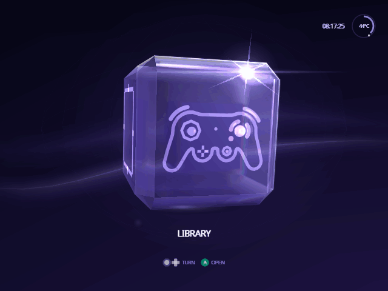
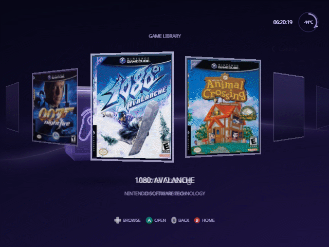

<h1 align="center">Indigo</h1>

<p align="center">
  <strong>A fork of Swiss for the Nintendo GameCube with the interface rebuilt.</strong><br>
  An animated Home, a poster library and game details, drawn in the console's own visual language.
</p>

<p align="center">
  <a href="https://norvitech.com"></a>
  <a href="https://github.com/spencercnorton/indigo/tags"></a>
  <a href="https://github.com/spencercnorton/indigo/releases/latest"></a>
  <a href="LICENSE"></a>
  <a href="https://buy.stripe.com/8x26oH2U44f65TRe574wM04"></a>
</p>

<p align="center">
  
</p>

Captured in the Dolphin emulator. The library and game detail pictures show a real poster pack and cheat file in use; box art belongs to its publishers.

Indigo is an unofficial fork of [Swiss](https://github.com/emukidid/swiss-gc),
the homebrew utility that boots and patches games on a Nintendo GameCube. The
fork changes one thing: what you look at. Everything underneath — the device
handlers, the patch engine, the loader — is upstream's work, and this fork
does not try to improve it. It is for people who use Swiss daily on real
hardware and want it to feel like it belongs on the console.

## What it does

**Home is an animated cube.** Four faces, one destination each: left and
right turn it sideways, up and down tip it over. It is glass, like the
GameCube's own menu: a soft reflection slides across it as it turns, and its
bevelled edges catch the light. Each face carries its own emblem, and only
the face you are on is named, under the cube. The Library face is a GameCube
controller that mirrors yours: its sticks lean with your sticks and its
buttons light as you press them, and when you leave it alone it plays by
itself. The GameCube's own interface language — the idle cube, the typeface,
the palette — is the reference, not a desktop launcher.

**The library retains its posters.** A grid over whatever device you booted
from, with artwork kept across navigation rather than re-read per frame, and
your selection restored when you come back from a game's details. Cover art
comes from a pack you build yourself (see [Posters](#posters)); without one,
each game gets a generated card.

<p align="center">
  
</p>

**Game details are a surface, not a dialogue.** Artwork, last played, save
data, cheats and the boot options for that title in one place, with the same
controller grammar as every other screen.

<p align="center">
  
</p>

**Cheats read clearly.** The cheat browser shows per-cheat state plainly, and
the runtime handling around it is stricter about what it will apply.

**Settings opens on what you change between games.** Quick settings fit
on one screen: menu music and sounds, In-Game Reset, memory-card emulation,
auto-loaded cheats and a few more. R moves to Game Defaults, what every game
starts with, and to Setup, which holds video, console, storage, network,
library and developer options in six sections. X on a game's detail screen
opens that game's own settings, where anything that differs from Game Defaults
is marked Custom and X puts it back. Holding the D-pad scrolls, A changes a value
(or, for a setting with many choices, lists them all), and B leaves and keeps
your changes. A new video mode only stays if you press
A within ten seconds. Settings can also be written ahead of time in a file on
the SD card: see [docs/SETTINGS.md](docs/SETTINGS.md). Setup › Storage says
whether that file loaded.

## Install

### Download

Each [release](https://github.com/spencercnorton/indigo/releases/latest) has
an `Indigo-vX.Y.Z.zip`. Its `SD card` folder holds everything that goes on
the card:

```text
SD card/
├── ipl.dol      Indigo; PicoBoot and other modchips boot this
├── games/       your games (see Set up your library)
└── swiss/ui/    posters.pak, if you build one
```

If your card already has an `ipl.dol` in its root, that is your current
Swiss: rename it to `z.dol` first (holding Z at power-on starts it). Then copy
the contents of `SD card` to the root of the card. With GC Loader or another
loader that boots a disc image, start `ipl.dol` from Swiss instead.

### Any platform — from source

The build runs in the same container image the project's CI uses, so no
toolchain is installed on your machine:

```bash
git clone https://github.com/spencercnorton/indigo.git
cd indigo
docker run --rm -u "$(id -u):$(id -g)" -v "$PWD:/work" -w /work \
  ghcr.io/extremscorner/libogc2 make dev
# writes cube/swiss/swiss.dol inside this folder, on your computer
```

The download above is this build at the release tag, packaged by
`buildtools/sd_package.sh`.

The release packaging targets (`make dist` and friends) are not supported
here: they need prebuilt tools and device firmware images that this fork does
not redistribute. `make dev` builds the executable, which is what the fork
changes.

### On the console

`cube/swiss/swiss.dol` is where the build leaves the file, not a path on your
SD card. On the card, Indigo takes the place of the file your loader already
boots, under that file's name. Your Swiss settings carry over.

- **PicoBoot** boots `ipl.dol` from the root of the card. Rename that file to
  `z.dol`, then copy `swiss.dol` to the root as `ipl.dol`. PicoBoot starts
  `z.dol` when Z is held at power-on, so stock Swiss stays one button away.
- **PicoBoot with no `ipl.dol` on the card** has Swiss flashed onto the Pico
  itself. Flash PicoBoot's standard firmware (see its
  [installation guide](https://support.webhdx.dev/gc/picoboot/installation-guide)),
  then do the step above.
- **Another loader that boots a `.dol` from the card by name**: replace that
  file the same way, keeping its name.
- **GC Loader, and other loaders that boot a disc image**: start `swiss.dol`
  from Swiss's file browser. This fork does not build `boot.iso` or the other
  packaged formats.

With In-Game Reset set to **Apploader**, a reset returns to the Swiss inside
`/swiss/patches/apploader.img`, not to Indigo; `make dev` does not rebuild
that file.

## Set up your library

### Games

The Library shows the games in one folder, `/games` at the root of the card.
Put each game in its own folder or put the disc images there directly, and
keep nothing else in that folder:

```text
/games/Super Mario Sunshine [GMSE01]/game.iso
/games/Super Mario Sunshine.iso
```

Disc images end in `.iso`, `.gcm`, `.tgc` or `.fdi`. Any other file in
`/games` (a text file, a cover image, an empty folder) turns the Library back
into Swiss's plain file list; "Hide unknown file types" in Settings → Setup →
Library hides stray files. On Home, turn the cube to Library and press A.

### Posters

Without posters, each game shows its disc banner and its six-character game
ID, such as `GMSE01`. For box art like the screenshots above, name front-cover
images after those IDs (`GMSE01.png`, `GALE01.jpg`, at least 192×256) in one
folder, build a pack from this repository, and copy it to
`/swiss/ui/posters.pak` on the card:

```bash
python3 -m pip install pillow
docker pull ghcr.io/extremscorner/libogc2@sha256:903b442dfd18cab00b5958726f70b17d95b0cf40c15d01b11e841825489dbe3d
python3 buildtools/ui/poster_pack.py --covers ~/covers --out posters.pak
```

Covers are cropped to 3:4 from the centre. Files not named by a game ID are
skipped and listed.

## Documentation

- [`CHANGELOG.md`](CHANGELOG.md) — what each release contains.
- [`NOTICE`](NOTICE) — upstream provenance and the third-party components in this tree.
- [`docs/screenshots/`](docs/screenshots) — the pictures above, captured in Dolphin.
- Upstream [Swiss documentation](https://github.com/emukidid/swiss-gc) covers every device handler, patch and boot option; none of it changed here.

## Contributing and support

- Bugs and feature requests: [open an issue](https://github.com/spencercnorton/indigo/issues/new/choose). Questions: [Discussions](https://github.com/spencercnorton/indigo/discussions). Do not report fork issues to the upstream project.
- Security reports: [private vulnerability reporting](https://github.com/spencercnorton/indigo/security/advisories/new) — see [SECURITY.md](SECURITY.md). There is no e-mail address; that is deliberate.
- Pull requests are welcome; read [CONTRIBUTING.md](CONTRIBUTING.md) first — this repository is a release mirror, and accepted changes ship in the next tagged release.
- If Indigo saves you time, you can [support its development](https://buy.stripe.com/8x26oH2U44f65TRe574wM04).

## Development

```bash
docker run --rm -u "$(id -u):$(id -g)" -v "$PWD:/work" -w /work \
  ghcr.io/extremscorner/libogc2 make dev      # what CI builds
buildtools/check_whitespace.sh
```

## Licence

[GPL-2.0-or-later](LICENSE) © Spencer Norton

Indigo is a modified version of [Swiss](https://github.com/emukidid/swiss-gc)
(© emukidid and the Swiss contributors, GPL-2.0-or-later) and inherits that
licence. Provenance, the modified surface and the third-party components in
this tree are recorded in [`NOTICE`](NOTICE). This fork is unofficial and is
not endorsed by or affiliated with the Swiss project.

Indigo's interface was built with [Claude Code](https://claude.com/claude-code).

---

<p align="center">
  <a href="https://norvitech.com"></a>
</p>

<p align="center">
  <a href="https://github.com/spencercnorton/helios">Helios</a> ·
  <a href="https://github.com/spencercnorton/bitagent">BitAgent</a> ·
  <a href="https://github.com/spencercnorton/xnote">XNote</a> ·
  <a href="https://github.com/spencercnorton/xnote-placement">XNote Placement</a> ·
  <a href="https://github.com/spencercnorton/snipsnap">SnipSnap</a> ·
  <a href="https://github.com/spencercnorton/indigo">Indigo</a> ·
  <a href="https://norvitech.com">norvitech.com</a>
</p>
