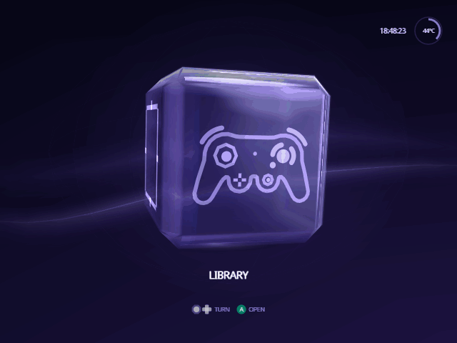
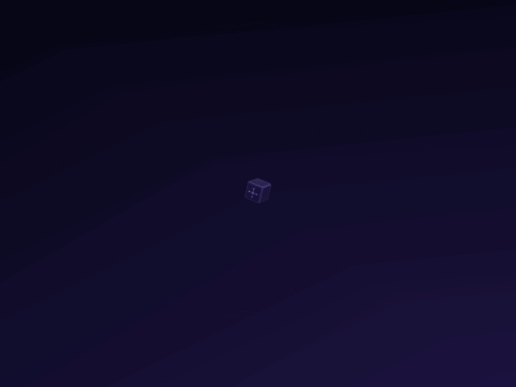
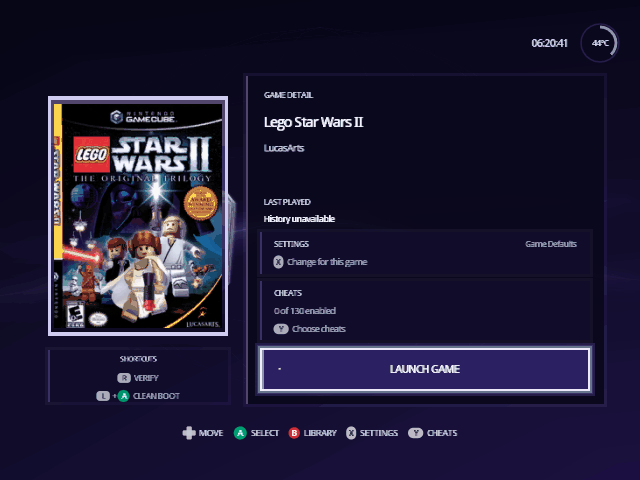
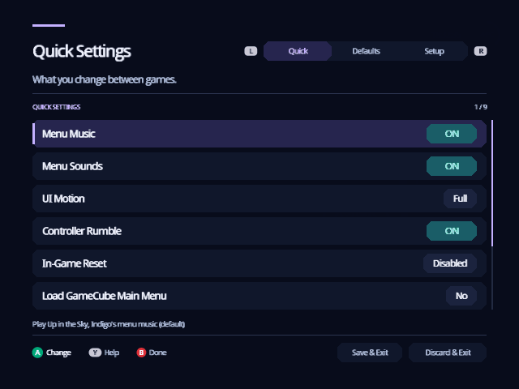
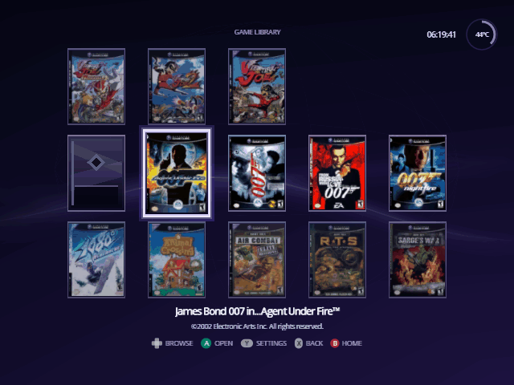
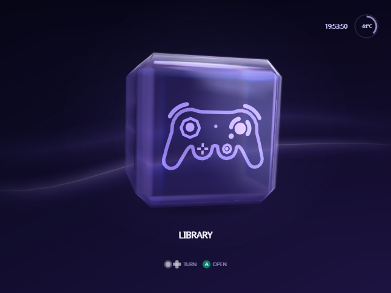
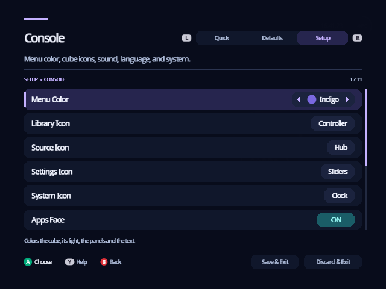
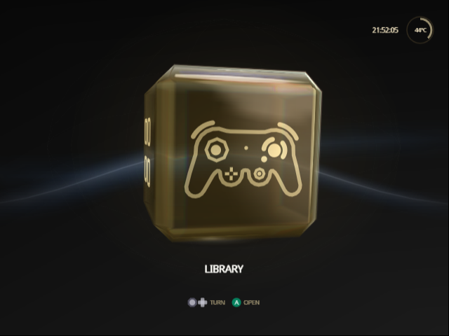
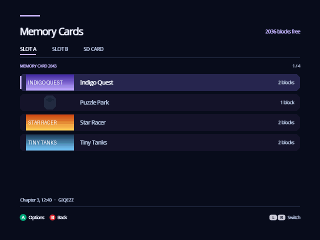

<h1 align="center">Indigo</h1>

<p align="center">
  <strong>A fork of Swiss for the Nintendo GameCube with the interface rebuilt.</strong><br>
  An animated Home, a poster library and game details, drawn in the console's own visual language.
</p>

<p align="center">
  <a href="https://norvitech.com"></a>
  <a href="https://github.com/spencercnorton/indigo/actions/workflows/ci.yml"></a>
  <a href="https://github.com/spencercnorton/indigo/releases/latest"></a>
  <a href="https://github.com/spencercnorton/indigo/releases/latest"></a>
  <a href="LICENSE"></a>
  <a href="https://buy.stripe.com/8x26oH2U44f65TRe574wM04"></a>
</p>

<p align="center">
  
</p>

Captured in the Dolphin emulator. The library and game detail pictures show a real poster pack and cheat file in use; box art belongs to its publishers.

**New to Indigo?** The [Indigo guide](docs/guide/README.md) walks through every screen and setting, with pictures.
Watch it in motion: [the video tour](https://norvitech.com/indigo/#videos) on norvitech.com.

Indigo is an unofficial fork of [Swiss](https://github.com/emukidid/swiss-gc),
the homebrew utility that boots and patches games on a Nintendo GameCube. The
fork changes one thing: what you look at. Everything underneath — the device
handlers, the patch engine, the loader — is upstream's work, and this fork
does not try to improve it. It is for people who use Swiss daily on real
hardware and want it to feel like it belongs on the console.

## What it does

**Home is an animated cube.** Four faces, one destination each, and a fifth,
Apps, when your card has programs in `/apps`: left and right turn it
sideways, up and down tip it over. When Indigo starts, the cube
flies in from the distance, spinning, and comes to rest on the face you
start on. It is glass, like the
GameCube's own menu, and it treats light the way glass does. Through the clear
front you see the cube's far edges, bent and slightly magnified, and a smoked
panel under each face's icon; the rounded edges part the light into colour
like a prism. Soft lights mirrored in the glass slide across it as it turns.
Highlights glow, a fine rim lights the edges that face the light, and the face
you are on lifts its icon a little off the glass, sharp, with a soft shadow
under it. Each face carries its own
emblem, and only the face you are on is named, under the cube. The Library face is a GameCube
controller that mirrors yours: its sticks lean with your sticks and its
buttons light as you press them, and when you leave it alone it plays by
itself. The GameCube's own interface language — the idle cube, the typeface,
the palette — is the reference, not a desktop launcher.

<p align="center">
  
</p>

**It has its own music.** The menus play "Up in the Sky" by Memoraphile
(CC0; see [`NOTICE`](NOTICE)): a quiet intro once, then a section that loops.
Settings › Quick › Menu Music turns it off.

**The library retains its posters.** The games in `/games` on the current
source, with artwork kept across navigation rather than re-read per frame,
and your selection restored when you come back from a game's details. It
opens as a row, with two covers either side of the game in the middle; it
can also be a column with the title beside the cover, a grid five covers
wide, or Spotlight: the selected game's gameplay still and description over
a row of disc banners (Setup › Library › Library Layout), a design that
comes from mvizensk's
[Gameplay Spotlight](https://github.com/mvizensk/gameplay-spotlight), with
their permission. Y on a game opens its own settings. Cover art comes from a
ready-made pack or one you build yourself (see [Posters](#posters)); without
one, each game gets a card with its disc banner.

<p align="center">
  
</p>

**Apps keeps your other programs apart.** Emulators, Game Boy Interface,
tools: put their `.dol` files in `/apps` and they get their own face of the
cube, shown as posters and started the way games are, never mixed in with
your games. Each app's picture is any PNG you put beside it (`gbi.png` for
`gbi.dol`); Indigo turns it into a poster on the console. See
[Apps](docs/guide/apps.md).

**Change Source shows the devices themselves.** Choose it on the Source
face: the cube lifts out of the way and the devices Indigo found line up
under it on glass tiles, each with its picture. Under the one in the middle, the picker says
what it can do, where it plugs in and whether Indigo detected it; the stick,
the D-pad, L and R slide the row. See [Source](docs/guide/source.md).

**Game details are a surface, not a dialogue.** Artwork, last played, save
data, cheats and the boot options for that title in one place, with the same
controller grammar as every other screen. A bright frame shows where you are:
the D-pad or the stick moves it between Launch Game, Cheats and Settings, and
A selects.

<p align="center">
  
</p>

**Starting a game from the Library shows its cover**, not Swiss's progress
boxes. The cover sits in a ring that fills as Indigo checks, prepares and
loads the game, one line under the title says which step it's on, and the
screen fades to black as the game starts.

**Cheats read clearly.** The cheat browser shows per-cheat state plainly, and
the runtime handling around it is stricter about what it will apply.

**Settings opens on what you change between games**, and reads like the
cheat browser: cards with ON and OFF switches, a line that says what the
highlighted setting does, and the buttons that work shown as icons. Its
first tab, Quick, holds nine: menu music and sounds, UI motion, rumble,
In-Game Reset, the GameCube main menu, memory-card emulation, auto-loaded
cheats and booting without prompts. R moves to the Defaults tab: Game Defaults, what every game
starts with. R again moves to Setup, which holds video, console, storage,
network, library and developer options in six sections. X on a game's detail
screen, or Y on its cover in the Library, opens that game's own settings, where
anything that differs from Game Defaults is marked Custom and X puts it back.
Holding the D-pad scrolls, A changes a value
(or, for a setting with many choices, lists them all), and B leaves and keeps
your changes. A new video mode waits for A, and only stays if you press
A again within ten seconds. Settings can also be written ahead of time in a file on
the SD card: see [docs/SETTINGS.md](docs/SETTINGS.md). Setup › Storage says
whether that file loaded.

<p align="center">
  
</p>

<p align="center">
  
</p>

**Indigo comes in eight colors.** Setup › Console › Menu Color recolors the
cube, its light, the panels and the text: Indigo, the default, or Azure,
Emerald, Gold, Spice, Crimson, Rose or Jet Black. Every color keeps Indigo's
brightness, and cover art, the button icons, warnings and enabled cheats keep
their own colors.

<p align="center">
  
</p>

A on Menu Color lists the colors, and the whole screen takes each one as you
move through the list. B keeps the color you had; A chooses the one you are on.

<p align="center">
  
</p>

Backdrop Color and Wave Color, under Menu Color, give the backdrop behind the
cube and the waves in front of it a color of their own, or let them follow
Menu Color as before: a Gold cube can sit over Azure waves on a Jet Black
backdrop.

<p align="center">
  
</p>

**Widescreen TVs get the whole screen.** Setup › Display › Menu Widescreen
draws Indigo for a TV set to 16:9: the background and its waves reach both
edges, and the cube, the text and every menu keep their shape in the middle.
Games have their own setting, Force Widescreen.

**Each face of the cube shows the picture you choose.** Setup › Console has a
row per face (Library Icon, Source Icon, Settings Icon and System Icon), and
each face has four icons of its own. Library has Controller, Books, Covers
and Play; Source has Hub, Disc, SD Card and Folder; Settings has Sliders,
Gear, Toggles and Dial; System has Clock, Info, Power and Chip. The time
and the temperature sit in the top right corner; Setup › Console › Clock
and Temperature each move theirs to the top left or hide it.

**Memory Cards moves your saves, like the GameCube's own screen.** System ›
Memory Cards shows two stacks of cubes side by side, Slot A's saves and Slot
B's, each cube with its game's animated icon. L and R choose storage;
with no physical cards, both columns open on SD. RAW virtual cards open to
browse and export their saves. A on a save shows its size, source and
recorded update date; A Actions opens Move, Copy and Erase. Move and Copy
send its cube flying to the other stack. Every copy is read back
before it counts, and a Move removes the original only then. Setup ›
Storage › Save Folder sets the folder the SD card's stack opens on
(`swiss/saves` until you choose one). See
[Memory Cards](docs/guide/memory-cards.md).

<p align="center">
  
</p>

## Install

### Download — drag and drop

Each [release](https://github.com/spencercnorton/indigo/releases/latest) has
an `Indigo-vX.Y.Z.zip` laid out exactly as it goes on the card:

```text
Indigo-README.txt              what goes where, in plain words
ipl.dol                        Indigo; PicoBoot and other modchips boot this
swiss/patches/apploader.img    Indigo again, for In-Game Reset
swiss/ui/                      posters.pak, if you add one (see Posters)
swiss/indigo/                  the licence and notice
```

**New to Indigo:**

1. First, before you copy anything: if your card already has an `ipl.dol` in
   its root, that is your current Swiss. Rename it to `z.dol` to keep it; with
   PicoBoot or PicoLoader, holding Z at power-on starts it.
2. Unzip the download, select everything inside and drag it onto the root of
   the card. Let it replace files of the same name. On a Mac, hold Option as
   you drop and choose **Merge**: **Replace** deletes what is already in the
   card's `swiss` folder (your settings, cheats and saves).
3. Put your games in `/games` (make the folder if the card has none), with
   nothing else in it or in the game folders, and power on.

**Updating from Indigo 1.x:** `ipl.dol` is already Indigo, so don't rename
it; copy the new files over it the same way (on a Mac, Merge). If you renamed
stock Swiss to `swiss.dol` for 1.25.0, you can rename it back to `z.dol`: 2.0
no longer starts it by itself
([#3](https://github.com/spencercnorton/indigo/issues/3)).

FlippyDrive boots `boot.dol`: replace that file with `ipl.dol`, keeping the
name `boot.dol`. With GC Loader and other loaders that boot a disc image,
start `ipl.dol` from Swiss instead. The
[install guide](docs/guide/install.md) covers every loader, updating and
going back to stock Swiss.

### Any platform — from source

The build runs in the same container image the project's CI uses, so no
toolchain is installed on your machine:

```bash
git clone https://github.com/spencercnorton/indigo.git
cd indigo
docker run --rm -u "$(id -u):$(id -g)" -v "$PWD:/work" -w /work \
  ghcr.io/extremscorner/libogc2@sha256:e6531ecaa458d0b5d8c9ba57cee1facc5fb9120808c6d9eebb2c05e4ffaf6f0f make dev
# writes cube/swiss/swiss.dol inside this folder, on your computer
```

The download above is this build at the release tag, packaged by
`buildtools/sd_package.sh`.

Upstream's packaging targets (`make all`, `make package`) are not supported
here: they need prebuilt tools and device firmware images that this fork does
not redistribute. `make dev` builds the executable, which is what the fork
changes.

### On the console

`cube/swiss/swiss.dol` is where the build leaves the file, not a path on your
SD card. On the card, Indigo takes the place of the file your loader already
boots, under that file's name. Your Swiss settings carry over.

- **PicoBoot and PicoLoader** boot `ipl.dol` from the root of the card.
  If that file is your current Swiss, rename it to `z.dol`; then copy
  `swiss.dol` to the root as `ipl.dol`.
  They start `z.dol` when Z is held at power-on, so stock Swiss stays one
  button away.
- **PicoBoot or PicoLoader with no `ipl.dol` on the card** has Swiss in the
  chip's flash. First flash the firmware that starts the card's `ipl.dol`:
  PicoBoot's `picoboot_full_pico.uf2` or `picoboot_full_pico2.uf2` (see its
  [installation guide](https://support.webhdx.dev/gc/picoboot/installation-guide)),
  or PicoLoader's `picoloader_gekkoboot.uf2`. Then do the step above.
- **Another loader that boots a `.dol` from the card by name**: replace that
  file the same way, keeping its name (FlippyDrive boots `boot.dol`).
- **GC Loader, and other loaders that boot a disc image**: start `swiss.dol`
  from Swiss's file browser. This fork does not build `boot.iso` or the other
  packaged formats.

With In-Game Reset set to **Apploader**, a reset returns to the program in
`/swiss/patches/apploader.img`. The release zip puts Indigo there, and
`buildtools/sd_package.sh` builds that file from `make dev`'s output.
**Reboot** resets the console, which starts whatever your loader boots.

## Set up your library

### Games

The Library shows the games in one folder, `/games` at the root of the card.
Put each game in its own folder or put the disc images there directly:

```text
/games/Super Mario Sunshine [GMSE01]/game.iso
/games/Super Mario Sunshine.iso
```

Disc images end in `.iso`, `.gcm`, `.tgc` or `.fdi`. The Library skips
anything else there, such as a text file, a cover image or an empty folder.
If `/games` holds no disc images at all, you get Swiss's plain file list
instead. Programs belong in `/apps` (see [Apps](#apps)). On Home, turn the
cube to Library and press A.

To sort your games into folders, turn on Settings › Setup › Library ›
**Library Folders**: the Library then shows the folders in `/games` as cards
you open, two levels deep. See
[Folders of games](docs/guide/library.md#folders-of-games).

### Posters

Without posters, each game shows its disc banner and its six-character game
ID, such as `GMSE01`. For box art like the screenshots above, download
[the poster pack](https://indigo.norvitech.com/indigo-posters-all.zip) and
unzip it into the root of the card. One pack covers games from every region,
so there is nothing to choose; it holds `swiss/ui/posters.pak` and the stills
and descriptions Spotlight shows (below). Checksums are in
[SHA256SUMS.txt](https://indigo.norvitech.com/SHA256SUMS.txt); the
[Indigo page](https://norvitech.com/indigo/) has the details.

To make your own, name front-cover images after the game IDs (`GMSE01.png`,
`GALE01.jpg`, at least 192×256) in one folder, build a pack from this
repository, and copy it to `/swiss/ui/posters.pak` on the card:

```bash
python3 -m pip install pillow
docker pull ghcr.io/extremscorner/libogc2@sha256:e6531ecaa458d0b5d8c9ba57cee1facc5fb9120808c6d9eebb2c05e4ffaf6f0f
python3 buildtools/ui/poster_pack.py --covers ~/covers --out posters.pak
```

Covers are cropped to 3:4 from the centre. Files not named by a game ID are
skipped and listed.

The Spotlight layout also shows each game's gameplay still from
`swiss/ui/stills.pak` and a few sentences about it from
`swiss/ui/descriptions.txt`, which the poster pack carries beside the
posters. Its covers and descriptions come from
[GameTDB](https://www.gametdb.com/), and its stills from
[libretro-thumbnails](https://github.com/libretro-thumbnails/Nintendo_-_GameCube),
as do the screenshots above. The descriptions file is plain text you can
edit (see [Posters](docs/guide/posters.md#game-descriptions)).
To build one from your own screenshots (at least 320×240, named like the
covers): `poster_pack.py --stills ~/screenshots --out stills.pak`. See
[Posters](docs/guide/posters.md#gameplay-stills).

### Apps

Put other programs (`.dol`, `.dol+cli` or `.elf`) in `/apps` at the root of
the card, loose or each in a folder of its own, and a picture beside each,
a PNG with the program's name. Home then gets an Apps face:

```text
/apps/gbi.dol
/apps/gbi.png
/apps/Genesis Plus GX/genplus_cube.dol
/apps/Genesis Plus GX/icon.png
```

A file called `boot.dol` is left out: in the Wii's Homebrew Channel layout it
is the Wii program. Settings › Setup › Console › Apps Face turns the face
off. [Apps](docs/guide/apps.md) has the rest.

### Cheats

Indigo runs Gecko codes from `/swiss/cheats/<game ID>.txt`, or from
`<game ID>_v102.txt` and the like for one revision of a disc.
[Download the cheat pack](https://indigo.norvitech.com/indigo-cheats.zip)
(every region), unzip it into the root of the card, open a game and press Y. Cheats that the files show
would break Indigo are switched off and marked;
[the download page](https://norvitech.com/indigo/#downloads) says what can't
be checked in advance.

## Documentation

- [Indigo guide](docs/guide/README.md) — install, controls, and every screen and setting, with pictures.
- [`CHANGELOG.md`](CHANGELOG.md) — what each release contains.
- [`NOTICE`](NOTICE) — upstream provenance and the third-party components in this tree.
- [`UPSTREAM`](UPSTREAM) — the upstream Swiss commit Indigo is built on, and the few upstream files it changes.
- [`docs/screenshots/`](docs/screenshots) — the pictures above, captured in Dolphin.
- Upstream [Swiss documentation](https://github.com/emukidid/swiss-gc) covers every device handler, patch and boot option; none of it changed here.

## Contributing and support

- Bugs and feature requests: [open an issue](https://github.com/spencercnorton/indigo/issues/new/choose). Questions: [Discussions](https://github.com/spencercnorton/indigo/discussions). Do not report fork issues to the upstream project.
- Security reports: [private vulnerability reporting](https://github.com/spencercnorton/indigo/security/advisories/new) — see [SECURITY.md](SECURITY.md). There is no e-mail address; that is deliberate.
- Pull requests are welcome: they go to the `beta` branch, and CI builds a test zip for each one. Read [CONTRIBUTING.md](CONTRIBUTING.md) first; [docs/RELEASING.md](docs/RELEASING.md) says how betas and release candidates become releases.
- If Indigo saves you time, you can [support its development](https://buy.stripe.com/8x26oH2U44f65TRe574wM04).

## Development

```bash
docker run --rm -u "$(id -u):$(id -g)" -v "$PWD:/work" -w /work \
  ghcr.io/extremscorner/libogc2@sha256:e6531ecaa458d0b5d8c9ba57cee1facc5fb9120808c6d9eebb2c05e4ffaf6f0f make dev   # the DOL, as CI builds it
buildtools/ui/tests/run_tests.sh all          # host tests: plain, sanitized, contracts
buildtools/check_whitespace.sh origin/beta    # lint
python3 buildtools/ci/check_upstream.py       # upstream's files match UPSTREAM
```

Work lands on `beta` by pull request and ships as `vX.Y.Z-beta.N` betas and
`vX.Y.Z-rc.N` release candidates, both pre-releases; a release candidate
that holds up is promoted to `main` as a release. See
[AGENTS.md](AGENTS.md) for the working detail.

## Licence

[GPL-2.0-or-later](LICENSE) © Spencer Norton

Indigo is a modified version of [Swiss](https://github.com/emukidid/swiss-gc)
(© emukidid and the Swiss contributors, GPL-2.0-or-later) and inherits that
licence. Provenance, the modified surface and the third-party components in
this tree are recorded in [`NOTICE`](NOTICE). This fork is unofficial and is
not endorsed by or affiliated with the Swiss project.

The Library's Spotlight layout takes its design from
[Gameplay Spotlight](https://github.com/mvizensk/gameplay-spotlight) by mvizensk
(GPL-2.0), with its author's permission; Indigo's code for it is its own.

Indigo's interface was built with [Claude Code](https://claude.com/claude-code).

---

<p align="center">
  <a href="https://norvitech.com"></a>
</p>

<p align="center">
  <a href="https://github.com/spencercnorton/helios">Helios</a> ·
  <a href="https://github.com/spencercnorton/bitagent">BitAgent</a> ·
  <a href="https://github.com/spencercnorton/xnote">XNote</a> ·
  <a href="https://github.com/spencercnorton/xnote-placement">XNote Placement</a> ·
  <a href="https://github.com/spencercnorton/snipsnap">SnipSnap</a> ·
  <a href="https://github.com/spencercnorton/conductor">Conductor</a> ·
  <a href="https://github.com/spencercnorton/norvi-os">NorviOS</a> ·
  <a href="https://github.com/spencercnorton/indigo">Indigo</a> ·
  <a href="https://github.com/spencercnorton/roadtrack">Road Track</a> ·
  <a href="https://norvitech.com">norvitech.com</a>
</p>
