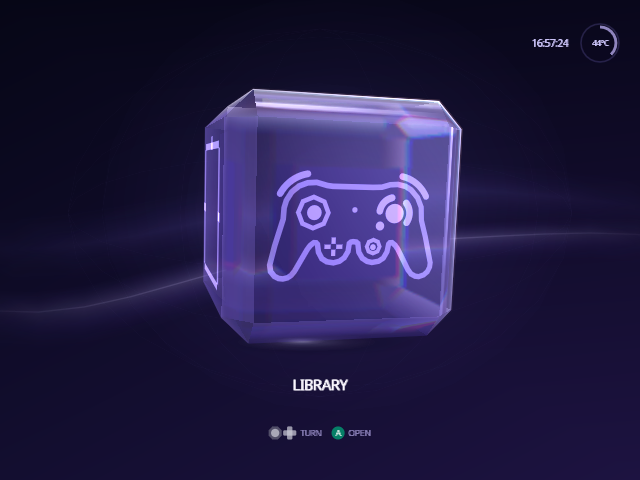
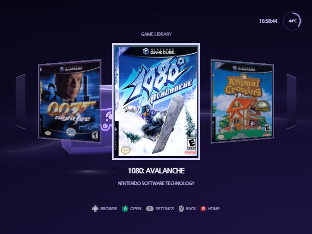
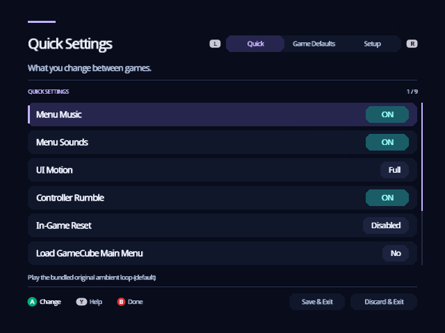
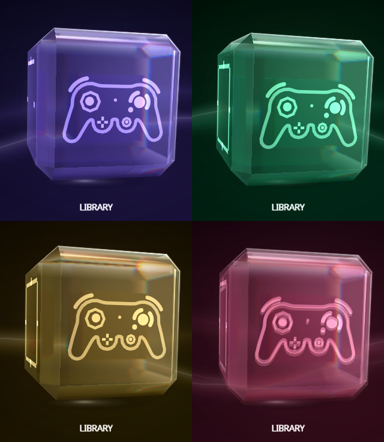
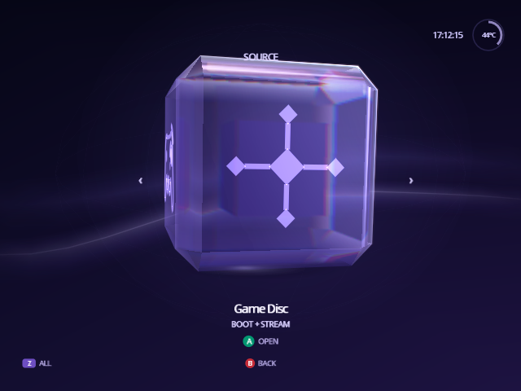
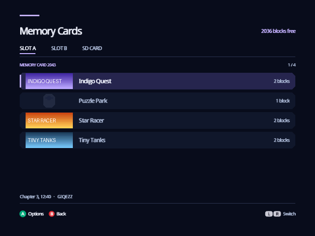
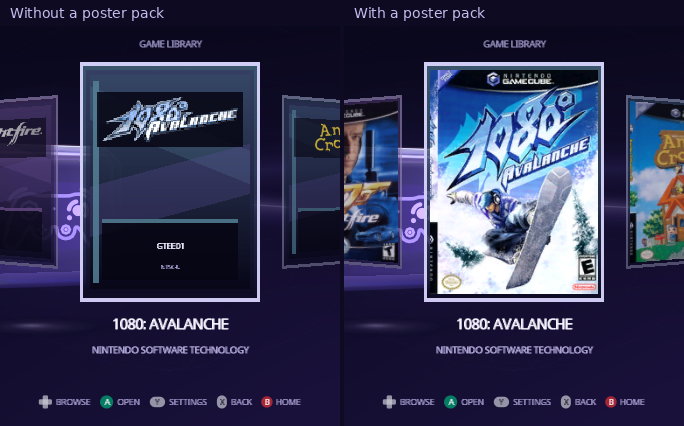
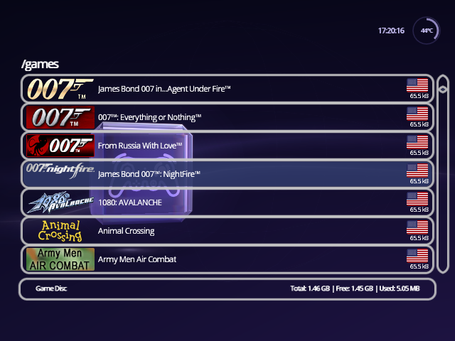

<h1 align="center">Indigo guide</h1>

  Every screen and setting in Indigo, with pictures from the real interface. 
  New to Indigo? Read <a href="install.md">Install</a>, then <a href="controls.md">Controls</a>. 
  Watch it in motion: <a href="https://norvitech.com/indigo/#videos">the video tour</a> on norvitech.com.

  

## Start here

- **[Install](install.md)**: put Indigo on your SD card, boot it, update it,
  and get back to stock Swiss when you want it.
- **[Controls](controls.md)**: what each button does on every screen.

## Using Indigo

<table>
  <tr>
    <td width="50%" valign="top">
       
      <b><a href="home.md">Home</a></b>: the cube and its four faces.
    </td>
    <td width="50%" valign="top">
       
      <b><a href="library.md">Library</a></b>: your games as posters, in a row, a column or a grid.
    </td>
  </tr>
  <tr>
    <td valign="top">
       
      <b><a href="game-details.md">Game details</a></b>: launch, settings and shortcuts for one game.
    </td>
    <td valign="top">
       
      <b><a href="cheats.md">Cheats</a></b>: switch Gecko codes on and off.
    </td>
  </tr>
  <tr>
    <td valign="top">
       
      <b><a href="settings.md">Settings</a></b>: Quick, Game Defaults, Setup and each game's own settings.
    </td>
    <td valign="top">
       
      <b><a href="personalize.md">Make it yours</a></b>: Menu Color, cube icons, motion and sound.
    </td>
  </tr>
  <tr>
    <td valign="top">
       
      <b><a href="source.md">Source</a></b>: choose the device your games come from.
    </td>
    <td valign="top">
       
      <b><a href="system.md">System</a></b>: console information and restarting Indigo.
    </td>
  </tr>
  <tr>
    <td valign="top">
       
      <b><a href="memory-cards.md">Memory Cards</a></b>: see, copy, move and delete your saves.
    </td>
    <td valign="top">
       
      <b><a href="posters.md">Posters</a></b>: box art from a ready-made pack, or your own.
    </td>
  </tr>
  <tr>
    <td valign="top">
       
      <b><a href="troubleshooting.md">Troubleshooting</a></b>: fixes for the common surprises.
    </td>
    <td valign="top"></td>
  </tr>
</table>

## Reference

- [Settings files](../SETTINGS.md): every key in `global.ini` and in a game's
  own file, for setting up a card on a computer.
- [Changelog](../../CHANGELOG.md): what each release changed.
- [Swiss documentation](https://github.com/emukidid/swiss-gc): device
  handlers, patches and boot options. Indigo leaves all of them as Swiss
  has them.

## About the pictures

Every picture here was recorded from Indigo running in the Dolphin emulator,
with the games, poster pack and cheat files on an emulated disc. The box art
belongs to its publishers. The recordings run without an SD card, so
Setup › Storage says there is no device to save settings to, and game details
have no Autoload shortcut. With an SD card in your console, both look as the
text describes. The Memory Cards pictures of the SD CARD tab, the Save Folder
and the folder chooser use a stand-in for the SD card that exists only for
recording, named GC Loader on screen, since Dolphin can't give a GameCube one.

---

<a href="install.md">Install →</a>

