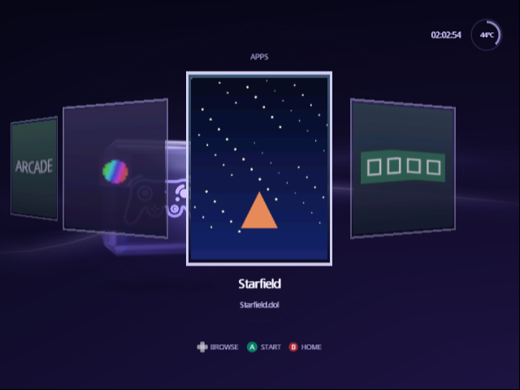
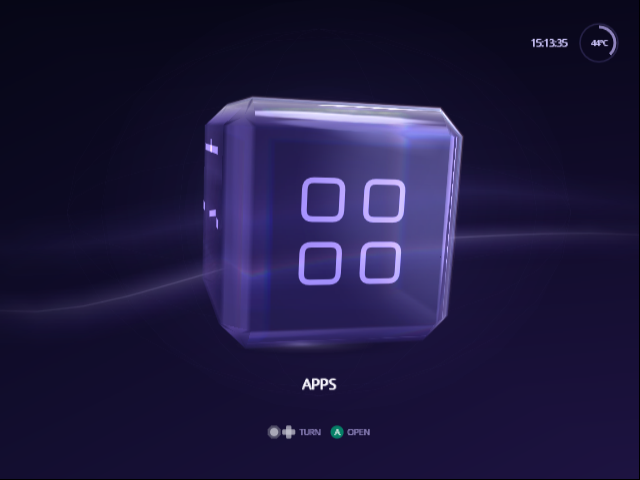

[Indigo guide](README.md) › Apps

# Apps

Apps is where the other programs on your card live: emulators, Game Boy
Interface, tools, any GameCube homebrew. They go in their own folder,
`/apps`, and show on their own face of the cube as posters, the way the
Library shows games, so they never mix in with your games.

<p align="center">
  
</p>

## Set up the apps folder

Make a folder called `apps` at the root of the card (or of whichever device
you chose on [Source](source.md)), next to `games`, and put the programs in
it:

```
apps/
  gbi.dol
  gbi.png
  gbihf.dol
  gbihf.png
  igr.dol
  Genesis Plus GX/
    genplus_cube.dol
    icon.png
```

- A program is any `.dol`, `.dol+cli` or `.elf` file, in `/apps` or in a
  folder inside it. Folders inside those folders aren't read.
- An app is called by its file name without the extension: `gbihf.dol`
  shows as gbihf. Rename the file to rename the app.
- Apps are in alphabetical order, and up to 256 of them show.
- Left out: a file called `boot.dol` or `boot.elf`, which in the Wii's
  Homebrew Channel layout is the Wii program; hidden files; and names that
  start with a dot, such as the `._` copies a Mac leaves on a card. Swiss's
  layout for a card shared with a Wii keeps both in one folder: the Wii's
  `boot.dol` and the GameCube's program under another name, and Apps shows
  only the GameCube one.

The **Apps** face appears on [Home](home.md) as soon as the card has an app,
one turn left of Library, or below it with a Classic cube. To keep it off
Home, set Settings › Setup › Console › **Down Face** to None (or put Apps
on another side with its own row); the programs stay where they are, and
the File Browser still starts them.

## Emulators

Programs in a folder called `emulators` at the root of the source make a
second screen just like Apps: the same folders, pictures, `.cli` arguments
and `.dcp` choices, headed EMULATORS. Its face is on no side of the cube
until you give it one: Settings › Setup › Console › **Up Face**, **Left
Face**, **Right Face** or **Down Face** › Emulators (see
[Choose the sides](home.md#choose-the-sides)). Programs can stay in `/apps`
too; Emulators only reads `/emulators`.

<p align="center">
  
</p>

### Real downloads

Most GameCube programs drop straight in:

- **Game Boy Interface**'s download already has `apps/gbi`, `apps/gbihf`
  and `apps/gbisr`, and a `GBI` folder: copy both to the root as they are.
  Each video setup is a program of its own (`gbihf-ossc`,
  `gbihf-direct-hdmi` and so on), so Apps lists every one; delete those
  you don't use to keep the list short.
- **Snes9x GX, FCE Ultra GX, Visual Boy Advance GX** and others that also
  come for the Wii: put the GameCube `.dol` in the Wii download's
  `apps/<name>` folder, and the Homebrew Channel's `icon.png` there becomes
  its poster. The Wii's `boot.dol` beside it is left out.
- **Swiss**, **Genesis Plus GX** and other single `.dol` files: drop them in
  `/apps`; without a picture, each gets a poster of its name.

### Programs that take options

Apps starts a program the way the File Browser does, so the files Swiss
reads beside it still work: a `.cli` file with the program's name
(`gbi.cli` for `gbi.dol`) gives it its command line, one argument a line,
and a `.dcp` file lists choices to pick from before it starts.

## Give an app a picture

Put a PNG beside the program, with the same name: `gbi.png` for `gbi.dol`.
An app in a folder can use the folder's `icon.png` instead, the Homebrew
Channel's icon file, and every program in that folder without a picture of
its own then shares it.

- Any size up to 2048 × 2048 pixels, and up to 2 MB.
- Any PNG, with or without transparency, but not interlaced. Most programs
  save PNGs that way; if a picture doesn't show, save it again with
  Interlace off.
- A picture shaped like a poster (3:4, such as 600 × 800) fills the card.
  Any other shape, like a square icon or the Homebrew Channel's wide
  128 × 48 banner, sits whole in the middle of the card, over a backdrop in
  its own colors. A small picture grows to at most four times its size.

Indigo turns each picture into a poster on the console the first time it's
shown, so there is nothing to convert on a computer and no pack to build.

An app without a picture, or with one Indigo can't read, gets a poster of
its name: the name in big letters, a line for each part where it has a `-`,
`_` or space, so `gbihf-direct-hdmi` reads GBIHF, DIRECT, HDMI. Its colour
comes from the first part, so a program's variants (every `gbihf-` of Game
Boy Interface) share one and stand apart from the rest.

## Use Apps

On Home, turn the cube to **Apps** and press A. The apps show as posters in
the layout you chose for the Library (Settings › Setup › Library › Library
Layout), and move the same way:

| To move | Horizontal | Vertical | Grid |
| --- | --- | --- | --- |
| To the next or previous app | Left, Right | Up, Down | Left, Right |
| To the app above or below | | | Up, Down |
| A page at a time | Up, Down, L, R | Left, Right, L, R | L, R |

- **A** starts the app. Its card rises into the launch screen, as a game's
  does, and the program takes over.
- **B** goes back to Home.

Apps opens on the app you were on last time. An app that can't start
because its file can't be read, is damaged or is too big says so, and you're
back on its card. A program made for the Wii can't run on a GameCube at all:
it stops on a black screen, and the console needs a restart.

Started apps join your recent list, like anything Swiss starts, when
Settings › Setup › Library › Recent List is on.

## When Apps doesn't look right

- **No Apps face on Home.** Check that Settings › Setup › Console › Apps
  Face is On. Otherwise the device has no app Indigo can show: check that
  the folder is called `apps`, sits at the root, and holds a `.dol` that
  isn't `boot.dol`. After adding apps to a device that stays connected, such
  as a network share, use Source › Refresh Library.
- **An app is missing.** It is named `boot.dol` or `boot.elf`, it is hidden,
  its name starts with a dot, or it is two folders deep.
- **An app has no picture.** The PNG must have the program's name (`gbi.png`
  for `gbi.dol`, in any case) or be its folder's `icon.png`, be no larger than
  2048 pixels a side and 2 MB, and not be interlaced.

---

<p align="center"><a href="posters.md">← Posters</a> · <a href="troubleshooting.md">Troubleshooting →</a></p>
