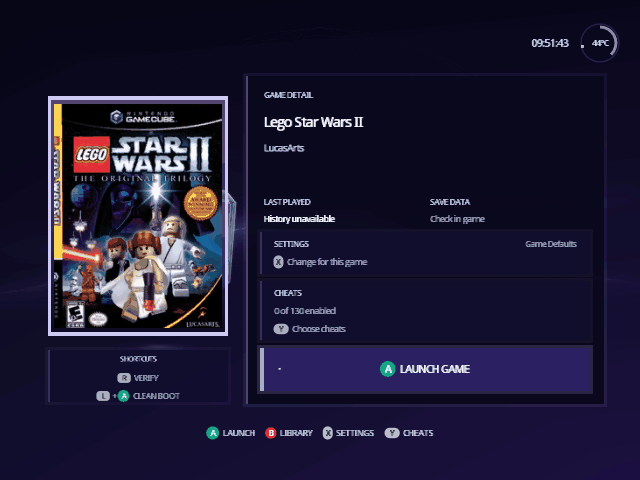
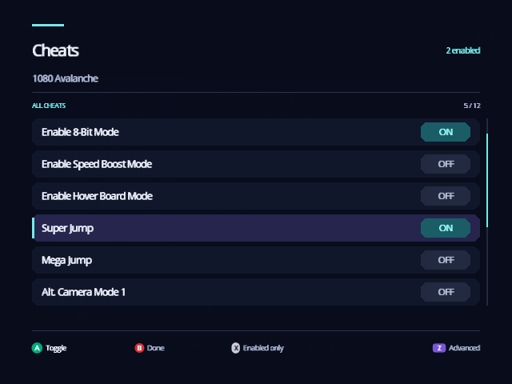
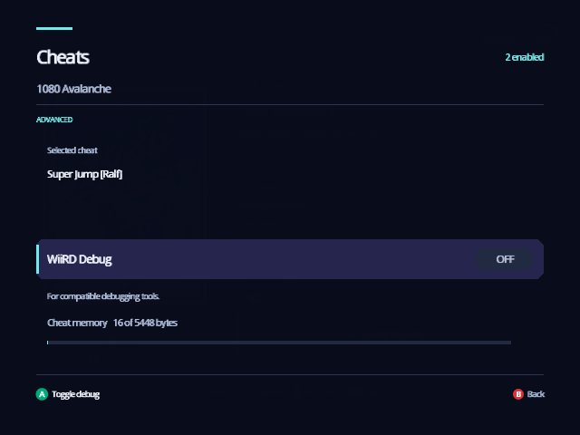

[Indigo guide](README.md) › Cheats

# Cheats

Indigo runs Gecko codes: cheats that change a game while it runs, from
infinite health to widescreen fixes. You switch them on per game, and Indigo
remembers your choice.

  

## Get cheat files

Indigo reads one file per game, `/swiss/cheats/<game ID>.txt`, such as
`/swiss/cheats/GALE01.txt` for Super Smash Bros. Melee. The quickest way to
get them is the ready-made pack, which covers every region:

- [Download the cheat pack](https://indigo.norvitech.com/indigo-cheats.zip)
  and unzip it into the root of the card.

Cheats that the pack's checks show would break Indigo are switched off in
the file and marked; [indigo.norvitech.com](https://indigo.norvitech.com)
says what the checks can't cover.

A game without a file says "No cheats found" on its detail screen.

## Switch cheats on

1. Open a game's [details](game-details.md) and press **Y**.
2. Move to a cheat and press **A** to switch it **On** or **Off**.
3. Press **B** when you're done. The detail screen now shows how many are
   on, and names them.
4. Press **A** to start the game with those cheats.

  

In the browser:

- The top right counts the cheats that are on, and the line above the list
  shows where you are in it, such as "5 / 12".
- **X** shows only the cheats that are on; X again shows them all.
- **Z** opens **Advanced** (below).

Indigo saves which cheats are on in a small `.chtsel` file beside the
game's cheat file, one per disc revision, so they're still on next time.
Cheats on a read-only device, such as a data disc, work but aren't saved.

## Start with your cheats every time

Normally the cheats that are on apply when you start the game after opening
the browser. Turn on **Auto-load cheats** in Settings › Quick and Indigo
applies your saved cheats whenever the game starts, without opening the
browser. It shows "Applied 3 cheats" (or however many) for a second as the
game starts.

## Advanced

  

- **Cheat memory** shows how much of the space for cheats is used. All the
  cheats that are on share it; if it's full, Indigo says "Not enough room.
  Turn off another cheat first."
- **WiiRD Debug** starts the game with the WiiRD debugger, for compatible
  debugging tools. It uses cheat memory too.

B goes back to the list.

---

<a href="game-details.md">← Game details</a> · <a href="settings.md">Settings →</a>

