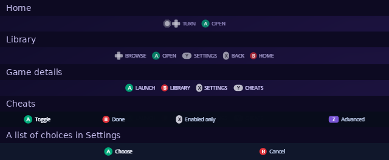

[Indigo guide](README.md) › Controls

# Controls

Indigo uses the same buttons for the same jobs everywhere, and the bottom of
every screen shows the buttons that work there, drawn as the controller's
own buttons.

  

## The short version

| Button | Does |
| --- | --- |
| Control stick or D-pad | Move. On Home, turn the cube. Hold to keep moving through a list. |
| A | Open or choose. |
| B | Go back. In Settings, leave and keep your changes. |
| X, Y, Z | The extra actions each screen names in its hints. Y explains a setting. |
| L, R | Switch tabs or pages. |
| START | Shows your recent games on Home, when Recent List is on. |

## Screen by screen

### Home

| Button | Does |
| --- | --- |
| Left, Right | Turn the cube to the next face. |
| Up, Down | Tip the cube over to the next face. |
| A | Open the face you're on. |
| START | Recently played games (Setup › Library › Recent List). |

The Source and System faces open a short list: move with the D-pad, A opens,
B goes back. See [Home](home.md).

### Source picker

| Button | Does |
| --- | --- |
| Left, Right | Show the next device. |
| A | Open the device, or try again if it wasn't detected. |
| Z | Show every device, or only the ones detected. |
| X | Change an SD adapter's speed. |
| Y | Details about the device. |
| B | Back. |

See [Source](source.md).

### Library

| Button | Does |
| --- | --- |
| D-pad or stick | Move through your games: see the layouts below. |
| A | Open the game's details. |
| Y | The game's own settings. Leaving them shows its details. |
| X | Up one folder. |
| B | Back to Home. |

How the D-pad moves depends on **Library Layout** (Setup › Library):

| To move | Horizontal | Vertical | Grid |
| --- | --- | --- | --- |
| To the next or previous game | Left, Right | Up, Down | Left, Right |
| To the game above or below | | | Up, Down |
| A page at a time | Up, Down, L, R | Left, Right, L, R | L, R |

See [Library](library.md).

### Game details

| Button | Does |
| --- | --- |
| A | Launch the game. |
| L + A | Clean boot: start the disc with no changes applied (disc drive only). |
| B | Back to the Library. |
| X | This game's own settings. |
| Y | Cheats. |
| Z | Autoload: open this game every time Indigo starts. Press again to turn it off. |
| R | Check the disc image's data, for discs Indigo can verify. |

Z appears when Indigo has a device to save settings to. See
[Game details](game-details.md).

### Cheats

| Button | Does |
| --- | --- |
| A | Switch the highlighted cheat on or off. |
| X | Show only the cheats that are on, or all of them. |
| Z | Advanced: cheat memory and the WiiRD debugger. |
| B | Done. |

See [Cheats](cheats.md).

### Settings

| Button | Does |
| --- | --- |
| Up, Down | Move between settings. Hold to scroll. |
| Left, Right | Step the highlighted setting to its previous or next value. |
| A | Change the value. On a setting with four or more choices, list them all. |
| Y | Explain the highlighted setting. Y again closes it. |
| L, R | Switch between Quick, Game Defaults and Setup. |
| X | In a game's own settings: put the setting back to Game Defaults. |
| B | Leave Settings, keeping your changes. In a Setup section, go back to the list of sections. |

In a list of choices, move to one and press A, or B to keep what you had.
See [Settings](settings.md).

### System information

| Button | Does |
| --- | --- |
| L, R | Previous or next page. |
| B | Back. |

See [System](system.md).

### During a game

With **In-Game Reset** on (Settings › Quick):

| Buttons | Does |
| --- | --- |
| A + Z + START | Leave the game. |
| R + Z + START | Restart the game. |

---

<a href="install.md">← Install</a> · <a href="home.md">Home →</a>

