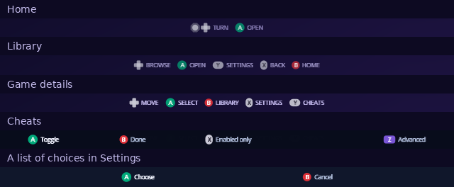

[Indigo guide](README.md) › Controls

# Controls

Indigo uses the same buttons for the same jobs everywhere, and the bottom of
every screen shows the buttons that work there, drawn as the controller's
own buttons.

  

## The short version

| Button | Does |
| --- | --- |
| Control stick or D-pad | Move. On Home, turn the cube. Hold to keep moving through a list. |
| A | Open or choose. |
| B | Go back. In Settings, leave and keep your changes. |
| X, Y, Z | The extra actions each screen names in its hints. Y explains a setting. |
| L, R | Switch tabs or pages. |
| START | Shows your recent games on Home, when Recent List is on. |

## Screen by screen

### Home

| Button | Does |
| --- | --- |
| Left, Right | Turn the cube to the next face. |
| Up, Down | Tip the cube over to the next face. |
| A | Open the face you're on. |
| B | With Setup › Console › Cube at Classic, turn back to Library. |
| START | Recently played games (Setup › Library › Recent List). |

The Source and System faces open a short list: move with the D-pad, A opens,
B goes back. See [Home](home.md). With a Classic cube, a direction turns
only from Library to a side and back: see
[Infinite or Classic](home.md#infinite-or-classic).

### Source picker

| Button | Does |
| --- | --- |
| Left, Right, L, R | Slide the previous or next device into the middle. The stick works too: hold it to keep going. |
| A | Open the device, or try again if it wasn't detected. |
| Z | Show every device, or only the ones detected. |
| X | Change an SD adapter's speed. |
| Y | Details about the device. |
| B | Back. |

See [Source](source.md).

### Library

| Button | Does |
| --- | --- |
| D-pad or stick | Move through your games: see the layouts below. |
| A | Open the game's details. |
| Y | The game's own settings. Leaving them shows its details. |
| X | Up one folder. |
| B | Back to Home. |

How the D-pad moves depends on **Library Layout** (Setup › Library):

| To move | Horizontal, Spotlight | Vertical | Grid |
| --- | --- | --- | --- |
| To the next or previous game | Left, Right | Up, Down | Left, Right |
| To the game above or below | | | Up, Down |
| A page at a time | Up, Down, L, R | Left, Right, L, R | L, R |

See [Library](library.md).

### Apps

| Button | Does |
| --- | --- |
| D-pad or stick | Move through your apps, as the Library moves: the table above. |
| A | Start the app. |
| B | Back to Home. |

See [Apps](apps.md).

### Game details

| Button | Does |
| --- | --- |
| Up, Down | Move between Launch Game, Cheats and Settings. |
| Left, Right | Choose the copy of the game's save to start with, when the Saves box shows two or more. |
| A | Open the one you're on: launch the game, or its cheats or settings. |
| L + A | Clean boot: start the disc with no changes applied (disc drive only). |
| B | Back to the Library, or to the File Browser when it opened them. |
| X | This game's own settings. |
| Y | Cheats. |
| Z | Autoload: open this game every time Indigo starts. Press again to turn it off. |
| R | Check the disc image's data, for discs Indigo can verify. |

The other buttons work wherever you are on the screen. Z appears when Indigo
has a device to save settings to. See [Game details](game-details.md).

### Cheats

| Button | Does |
| --- | --- |
| A | Switch the highlighted cheat on or off. |
| X | Show only the cheats that are on, or all of them. |
| Z | Advanced: cheat memory and the WiiRD debugger. |
| B | Done. |

See [Cheats](cheats.md).

### Settings

| Button | Does |
| --- | --- |
| Up, Down | Move between settings. Hold to scroll. |
| Left, Right | Step the highlighted setting to its previous or next value. A video setting waits for A. |
| A | Change the value. On a setting with four or more choices, list them all. On a video setting, switch to the value shown. |
| Y | Explain the highlighted setting. Y or B closes it. |
| L, R | Switch between the Quick, Defaults and Setup tabs. |
| X | In a game's own settings: put the setting back to Game Defaults. |
| B | Leave Settings, keeping your changes. In a Setup section, go back to the list of sections. |

In a list of choices, move to one and press A, or B to keep what you had.
See [Settings](settings.md).

### System information

| Button | Does |
| --- | --- |
| L, R | Previous or next page. |
| B | Back. |

See [System](system.md).

### Memory Cards

| Button | Does |
| --- | --- |
| Control stick or D-pad | Move from cube to cube. Left and Right cross from one stack to the other; Up and Down scroll a stack. Hold to keep moving. |
| L, R | Swap the left (L) or right (R) stack for Slot A, Slot B or the SD card. |
| A | On a save: open its details, then A Actions for Move, Copy or Erase. On a folder or card image: open it. |
| Y | On a small folder or card-image cube: its full path, contained saves and color. |
| B | Close a box or cancel. On the SD card's stack, in a folder it opened: up a folder. Otherwise: leave Memory Cards. |
| X | When choosing a folder: choose the one that's open. |

See [Memory Cards](memory-cards.md).

### File Browser

Two panes of files, from System › File Browser, the File Browser face, and
wherever Indigo lists files outside the Library.
See [File Browser](system.md#file-browser).

| Button | Does |
| --- | --- |
| Up, Down | Move a row. Hold to keep moving. |
| Left, Right | Move to the other pane. |
| C-stick | A page up or down. |
| A | Open a folder. In the left pane, a game's details, or start a file. A file that doesn't start: its actions. |
| X | Up a folder. At the top, choose that side's storage. |
| L, R | Choose the left or the right side's storage. |
| Y | Swap the two sides: the right pane becomes your source. |
| Z | A file or folder: its actions, to Copy or Move it to the other pane's folder, Rename, Hide or Delete it. `..`: Autoload this folder. |
| START | Recently played games. |
| B | Back to the face that opened it: System, or File Browser. |

In the actions box, Up and Down move, A chooses, B closes, and each action's
letter chooses it at once: X Copy, Y Move, R Rename, L Hide, Z Delete.
Delete asks for L held with A. While a file copies, B stops it.

### During a game

With **In-Game Reset** on (Settings › Quick):

| Buttons | Does |
| --- | --- |
| A + Z + START | Leave the game. |
| R + Z + START | Restart the game. |

---

<a href="install.md">← Install</a> · <a href="home.md">Home →</a>

