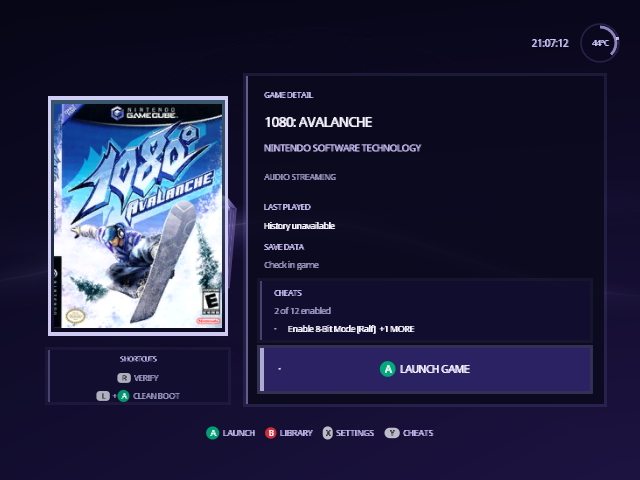
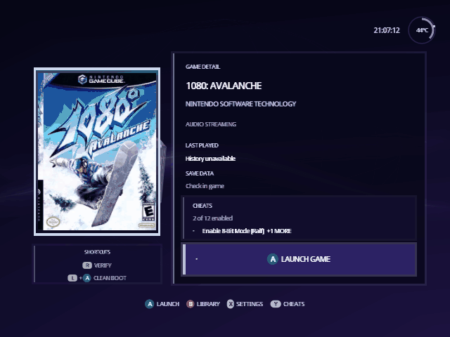

[Indigo guide](README.md) › Game details

# Game details

A on a game in the [Library](library.md) opens its details: everything about
that one game, and every way to start it, on one screen.

  

## What's on the screen

- **The cover**: the game's poster, or its disc banner if you have no
  [poster pack](posters.md).
- **Title and publisher**, from the disc's banner. Under them, notes when
  they apply: **Audio Streaming** for a game that plays music streamed from
  the disc, **Disc 2 Ready** when Indigo has found the game's second disc,
  and **Autoload** (below).
- **Last played**: the date you last started the game from Indigo, or "No
  play recorded". Indigo records it when your settings live on the card the
  game starts from, as with a single SD card. With no settings device to
  read it from, it says "History unavailable".
- **Save data**: "Check in game". Indigo doesn't read your memory cards, so
  the game itself is where to look.
- **Cheats**: how many of the game's cheats are on and the names of the first
  ones, or "Y Choose cheats" when none are. It reads "No cheats found" when
  there's no cheat file for the game. See [Cheats](cheats.md).
- **Launch Game**, the button A presses.
- **Shortcuts**: the extra ways to start or check the game (below).

## Start the game

Press **A**. Indigo applies the game's settings and your cheats, then starts
it.

**L + A** is a clean boot, shown when the game is in the disc drive (or a
drive replacement that sits in its place). The console resets and starts the
game the normal way, with nothing changed: no patches, cheats or forced
video modes. Region restrictions apply. If a game should always start this
way, turn on **Prefer Clean Boot** in its own settings; A then reads
**Clean Boot**.

To start games straight from the Library without this screen, turn on
**Boot without prompts** in Settings › Quick. Hold B while you choose a game
to see its details anyway; that turns Boot without prompts off until you
restart.

## This game's own settings

**X** opens settings that apply to this game only: its video mode,
widescreen, language, polling rate and the rest. Anything you change is marked
**Custom**, and the detail screen's **Settings** line counts them and names
the first, for example "1 custom" and "Force Video Mode: 480p". With none, it
reads "Game Defaults". In the Library, a game with any Custom setting shows
a small sliders mark in the corner of its cover.

  

In a game's own settings, **X** puts the highlighted setting back to the
Game Defaults value, and **B** leaves. The rest works like the main
[Settings](settings.md#a-games-own-settings).

## Autoload

**Z** marks the game to open every time Indigo starts, so its details are
the first thing you see. With **Boot without prompts** on, the game starts
straight away instead. The shortcut then reads **Z Autoload On**; press Z
again to turn it off.

Autoload is saved in your settings file, so it appears only when Indigo has
a device to save to.

## Verify

**R** reads the whole disc image, compares it with the known good copy of
that disc and tells you whether it passed. It appears for discs Indigo can
check. Use it when a game crashes or won't start, to rule out a damaged file.

---

<a href="library.md">← Library</a> · <a href="cheats.md">Cheats →</a>

