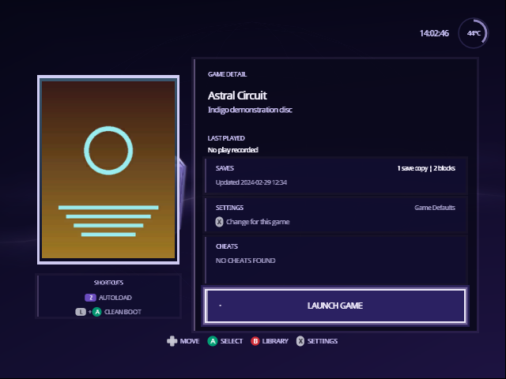
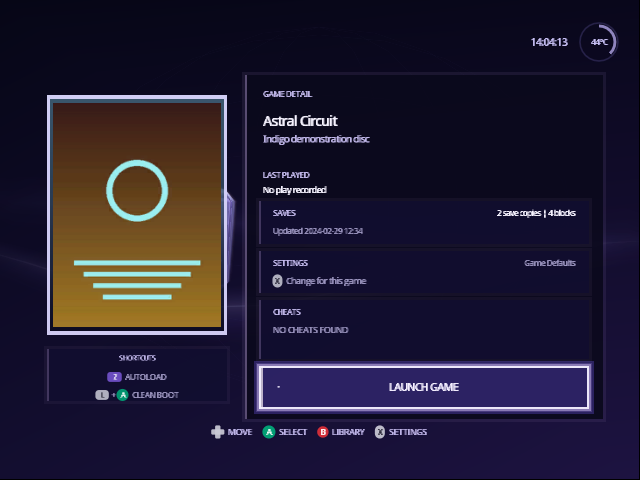
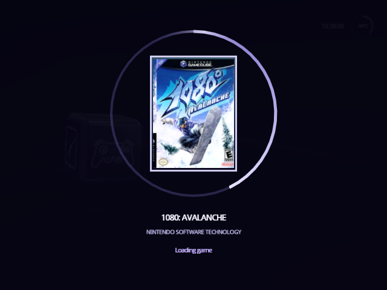
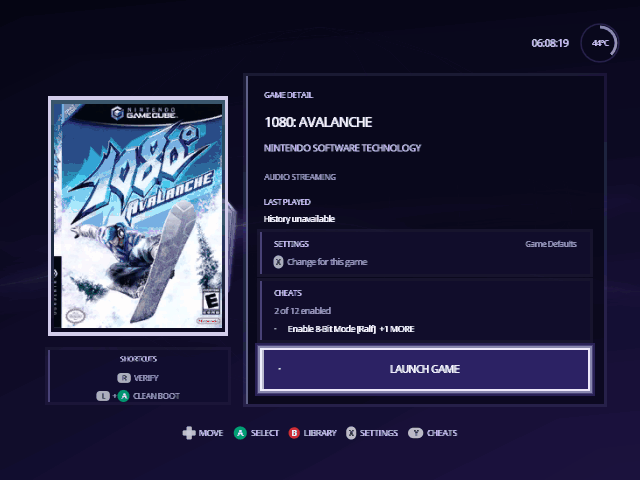

[Indigo guide](README.md) › Game details

# Game details

A on a game in the [Library](library.md) opens its details: everything about
that one game, and every way to start it, on one screen. A on a game in the
left pane of the [File Browser](system.md#file-browser) opens the same
screen, and **B** there goes back to the File Browser, on the same row.

  

## What's on the screen

- **The cover**: the game's poster, or its disc banner if you have no
  [poster pack](posters.md).
- **Title and publisher**, from the disc's banner. Under them, notes when
  they apply: **Audio Streaming** for a game that plays music streamed from
  the disc, **Disc 2 Ready** when Indigo has found the game's second disc,
  and **Autoload** (below).
- **Last played**: the date you last started the game from Indigo, or "No
  play recorded". Indigo records it when your settings live on the card the
  game starts from, as with a single SD card. With no settings device to
  read it from, it says "History unavailable".
- **Saves**, above Settings and Cheats, when the game has two or more save
  copies: their number and total blocks appear first, with the latest update
  beneath them. These totals come from inserted memory cards and the
  configured Save Folder, including readable RAW images there. It matches
  the full game and maker ID, not the title. A RAW save and an exported GCI
  count as separate copies; this isn't a progress score. **Updated** is the
  newest date recorded in those saves, and a scan that couldn't read
  everything says **Partial scan**. Settings › Setup › Library ›
  **Saves on Details** turns the box off, and then a game's details don't
  read your memory cards at all. System › [Memory Cards](memory-cards.md)
  opens the individual saves and their details.
- **Settings**: "Game Defaults" while the game follows them, or how many of
  its settings are its own and the first of them, such as "1 custom" and
  "Force Video Mode: 480p". See [below](#this-games-own-settings).
- **Cheats**: how many of the game's cheats are on and the names of the first
  ones, or "Y Choose cheats" when none are. It reads "No cheats found" when
  there's no cheat file for the game. See [Cheats](cheats.md).
- **Launch Game**, where the screen opens (below).
- **Shortcuts**: the extra ways to start or check the game (below).

A game with one save copy shows no Saves box. Copying a save from a RAW
image into the Save Folder makes a second copy, and opening the game's
details again shows it: **2 save copies | 4 blocks**, with the recorded
update.

  

### Start with another copy of the save

With two or more copies, **Left** and **Right** step through them, and the
label reads **« SAVES »**. The box shows one copy at a time, such as
**Copy 2 of 3 | Save Folder**, with its date and either **In use**, for the
copy on the memory card the game reads, or **Loads at launch**.

Launch the game with another copy shown and Indigo asks first. **A** puts
that copy on the memory card in place of the card's own copy of the save:
the card's own copy goes to the Save Folder first, the new one is read back
from the card, and if anything goes wrong the card's own copy goes back and
the game doesn't start. **B** leaves the card as it is. The copy goes on
the card that holds the game's save, Slot A first; with no copy on a card,
on the card in Slot A, or in Slot B when Slot A is empty.

It isn't offered while **Emulate Memory Card** is on, since the game then
reads a card image on the SD card rather than the card in the slot.

## Start the game

The screen opens with a bright frame on **Launch Game**: press **A** to
start the game. The details make way for the game's cover, centred in a
ring that fills as Indigo applies the game's settings and your cheats,
prepares the game and loads it. One line under the title says which step
it's on, such as "Checking game" or "Loading game". If the game's patches
live on another card than the game, that card is named under it ("Do not
remove SD Card - SD2SP2"): leave it in until the game is running. When the
ring is full the screen fades to black and the game starts. With
[UI Motion](personalize.md#motion) set to Off, the ring fills in steps
without its glint, and the screen goes straight to black.

  

If the game can't start, a message says why, and then the Library (or the
File Browser) comes back.

Up and down on the D-pad or the control stick move the frame between
**Launch Game**, **Cheats** and **Settings**, and **A** opens the one it's
on. Cheats is passed over when the game has none. The other buttons on this
page (X, Y, Z, R, L + A and B) work wherever the frame is, and the frame is
still where you left it when you come back from Settings or Cheats.

**L + A** is a clean boot, shown when the game is in the disc drive (or a
drive replacement that sits in its place). The console resets and starts the
game the normal way, with nothing changed: no patches, cheats or forced
video modes. Region restrictions apply. If a game should always start this
way, turn on **Prefer Clean Boot** in its own settings; Launch Game then
reads **Clean Boot**.

To start games straight from the Library without this screen, turn on
**Boot without prompts** in Settings › Quick; the cover and its ring show
all the same. Hold B while you choose a game to see its details anyway; that
turns Boot without prompts off until you restart.

## This game's own settings

**X** opens settings that apply to this game only: its video mode,
widescreen, language, polling rate and the rest. In the
[Library](library.md#moving-around), **Y** on the game's cover opens them
straight away, and leaving them shows these details. Anything you change is marked
**Custom**, and the detail screen's **Settings** line counts them and names
the first, for example "1 custom" and "Force Video Mode: 480p". With none, it
reads "Game Defaults". In the Library, a game with any Custom setting shows
a small sliders mark in the corner of its cover.

  

In a game's own settings, **X** puts the highlighted setting back to the
Game Defaults value, and **B** leaves. The rest works like the main
[Settings](settings.md#a-games-own-settings).

## Autoload

**Z** marks the game to open every time Indigo starts, so its details are
the first thing you see. With **Boot without prompts** on, the game starts
straight away instead. The shortcut then reads **Z Autoload On**; press Z
again to turn it off.

Autoload is saved in your settings file, so it appears only when Indigo has
a device to save to.

## Verify

**R** reads the whole disc image, compares it with the known good copy of
that disc and tells you whether it passed. It appears for discs Indigo can
check. Use it when a game crashes or won't start, to rule out a damaged file.

---

<a href="library.md">← Library</a> · <a href="cheats.md">Cheats →</a>

