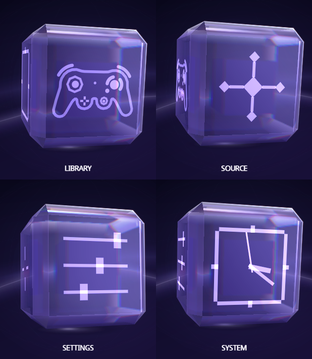
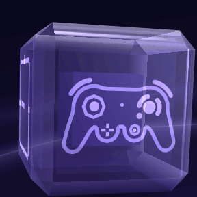

[Indigo guide](README.md) › Home

# Home

Home is a glass cube with one destination on each of its four faces. Turn the
cube to the face you want and press A.

  

## The four faces

  

| Face | A opens |
| --- | --- |
| **Library** | Your games, as posters. See [Library](library.md). |
| **Source** | A short list: **Change Source** picks the device your games come from, and **Refresh Library** reads it again, for example after you swap the disc. See [Source](source.md). |
| **Settings** | Settings. See [Settings](settings.md). |
| **System** | A short list: **System Information** and **Restart Indigo**. See [System](system.md). |

Left and Right turn the cube sideways; Up and Down tip it over. Either way you
reach the next face, and the name under the cube tells you which face is in
front. The face icons can be changed: see [Make it yours](personalize.md#cube-icons).

Indigo starts on Library when it finds a device to read games from. If it
doesn't, it starts on Source, and A on Library takes you there too.

## The glass

The cube is glass, and it treats light the way glass does:

- **It bends what is behind it.** Through the front you see the cube's far
  edges, its inner cube and the backdrop, slightly magnified across the faces
  and pulled round the rounded edges.
- **It parts light into colour.** Where the bend is strongest, on the rounded
  edges, light splits into red, green and blue like a prism.
- **It glows.** Highlights and glints have a soft glow, a fine rim lights
  the edges that face the light, and a halo sits behind the cube with a patch
  of focused light on the floor under it. The face icons stay sharp on top
  of the glass.

Every part follows your [Menu Color](personalize.md), except the prism's
fringes, which keep their own colors. With UI Motion set
to Reduced or Off, the cube's gentle sway stops; the
glass still bends light and glows. Behind Settings the cube keeps its plain
glass.

## The controller on the Library face

The controller on the Library face follows the one in your hand. Its sticks
lean as you move yours, and its buttons light while you hold them. Leave it
alone for two seconds and it starts playing by itself.

  

With **UI Motion** set to Reduced or Off, it only follows your controller and
never plays by itself. UI Motion is in Settings › Quick.

## Around the cube

- **Top right:** the time and the console's CPU temperature. The
  temperature has no factory calibration; adjust it in Settings › Setup ›
  Console › CPU Temperature Calibration.
- **Bottom:** the buttons that work here.
- **Music and sounds:** Indigo plays its own ambient loop and soft navigation
  sounds. Turn either off in Settings › Quick.
- **START:** shows your recently played games, when Settings › Setup ›
  Library › Recent List is on.

---

<a href="controls.md">← Controls</a> · <a href="library.md">Library →</a>

