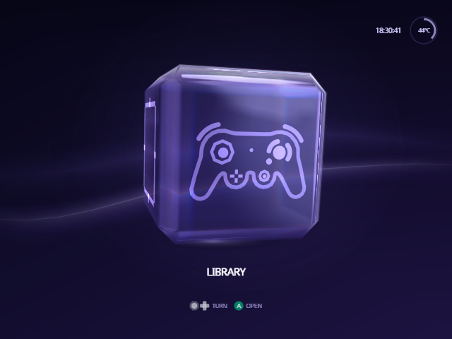

[Indigo guide](README.md) › Install

# Install

Indigo is a single program, `ipl.dol`, that runs in place of Swiss. It reads
the same settings, cheats and saves as Swiss, so nothing on your card has to
move.

**You need** a GameCube that already starts Swiss (with PicoBoot, PicoLoader,
FlippyDrive, GC Loader or the like) and reads an SD card, in an SD2SP2, an SD
Gecko or the loader's own slot, and a computer to copy files to the card. A
Wii with GameCube ports works too, running Swiss in GameCube mode with the
card in an SD Gecko.

## 1. Download

Each [release](https://github.com/spencercnorton/indigo/releases/latest) has
an `Indigo-vX.Y.Z.zip`. It is laid out exactly as it goes on the card, so
installing is drag and drop:

```text
Indigo-README.txt              what goes where, in plain words
ipl.dol                        Indigo
swiss/patches/apploader.img    Indigo again, for In-Game Reset
swiss/ui/                      the poster pack, if you add it (see Posters)
swiss/indigo/                  the licence and notice
```

## 2. Put it on the card

Pick the line that matches how your console starts Swiss.

**PicoBoot, PicoLoader, and other modchips that boot `ipl.dol` from the card.**
First, before you copy anything: if the root of the card already has an
`ipl.dol`, that is your current Swiss. Rename it to `z.dol` to keep it.
PicoBoot and PicoLoader start `z.dol` when you hold Z at power-on, so stock
Swiss stays one button away. Then unzip the download, select everything
inside and drag it onto the root of the card, and let it replace files of
the same name.

**PicoBoot or PicoLoader with no `ipl.dol` on the card.** Swiss is in the
chip's flash. First flash the firmware that starts the card's `ipl.dol`:
PicoBoot's `picoboot_full_pico.uf2`, or `picoboot_full_pico2.uf2` on a Pico 2
(see its [installation guide](https://support.webhdx.dev/gc/picoboot/installation-guide)),
or PicoLoader's `picoloader_gekkoboot.uf2`. Then follow the step above.

**A loader that boots a `.dol` from the card by name.** Replace that file
with `ipl.dol`, keeping the old file's name. FlippyDrive, for one, boots
`boot.dol`.

**GC Loader, or a loader that boots a disc image.** Drag everything in the
download onto the root of the card, start Swiss the way you do now, and open
`ipl.dol` from Swiss's file list. Indigo doesn't build a `boot.iso`.

**On a Mac**, hold Option as you drop the files on the card and choose
**Merge**. **Replace** deletes what is already in the card's `swiss`
folder: your settings, cheats and saves.

Then put your games in `/games` (make the folder if the card has none): see
[Set up the games folder](library.md#set-up-the-games-folder).

## 3. First boot

Indigo opens on Home, a glass cube with one destination on each face. If it
found a device to read from, the cube faces **Library**; press A to see your
games. If it found none yet, it faces **Source**, where you choose one.

On a card with no settings yet, Indigo first opens Settings › Setup ›
Storage › **Configuration Device**. Choose **Save & Exit** to write your
settings to the card, and Indigo goes on to Home.

<p align="center">
  
</p>

Next:

- [Set up your library](library.md#set-up-the-games-folder): put your
  games in a `/games` folder. To sort them into folders, see
  [Folders of games](library.md#folders-of-games).
- [Add posters](posters.md) for box art, and [cheats](cheats.md) if you
  want them.
- Learn the [controls](controls.md).

## Update Indigo

Don't rename anything this time: your `ipl.dol` (or the file you replaced
in step 2) is already Indigo. Unzip the new release and copy its files over
the old ones as in step 2, letting them replace files of the same name (on a
Mac, choose **Merge**). Your settings, poster pack, cheats and saves stay
where they are.

Updating from Indigo 1.x: if you renamed stock Swiss to `swiss.dol` for
1.25.0, you can rename it back to `z.dol`. 2.0 no longer starts it by itself
([#3](https://github.com/spencercnorton/indigo/issues/3)).

## Go back to stock Swiss

- **PicoBoot and PicoLoader:** hold Z while you switch the console on to
  start `z.dol`.
- **Other loaders:** put your old file back, or start stock Swiss from your
  loader as before.
- In-Game Reset set to Apploader returns to Indigo until you put back stock
  Swiss's own `swiss/patches/apploader.img`, from `Apploader/EXTRACT_TO_ROOT.zip`
  in the Swiss release.

Both use the same settings file. Indigo keeps your comments in it when it
saves. Stock Swiss rewrites the whole file when it saves and leaves out the
settings only Indigo has, such as Menu Color, the face icons, Library Layout
and Save Folder, so those are back to their defaults the next time Indigo
starts.

## Leaving a game

With **In-Game Reset** turned on (Settings › Quick), hold **A + Z + START**
during a game to leave it, or **R + Z + START** to restart it. Set it to
**Apploader** to come back to Indigo: the zip's `swiss/patches/apploader.img`
is Indigo. **Reboot** resets the console, which starts whatever your loader
boots (with GC Loader, its `boot.iso`).

## Build it yourself

The build runs in the container image the project's CI uses, so nothing is
installed on your computer:

```bash
git clone https://github.com/spencercnorton/indigo.git
cd indigo
docker run --rm -u "$(id -u):$(id -g)" -v "$PWD:/work" -w /work \
  ghcr.io/extremscorner/libogc2@sha256:e6531ecaa458d0b5d8c9ba57cee1facc5fb9120808c6d9eebb2c05e4ffaf6f0f make dev
```

This writes `cube/swiss/swiss.dol`. That is the same program as `ipl.dol`
in the release zip; copy it to the card under the name your loader expects.
`buildtools/sd_package.sh vX.Y.Z` packs it into the zip, with the
`apploader.img` In-Game Reset returns to.

---

<p align="center"><a href="README.md">← Guide</a> · <a href="controls.md">Controls →</a></p>
