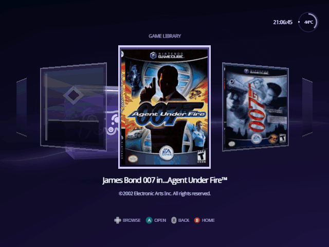
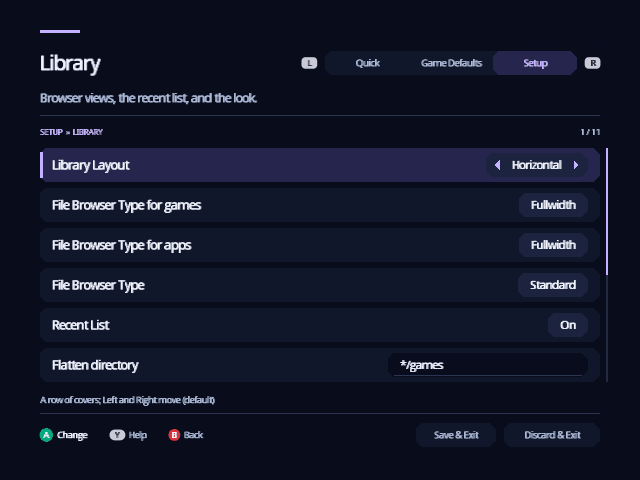
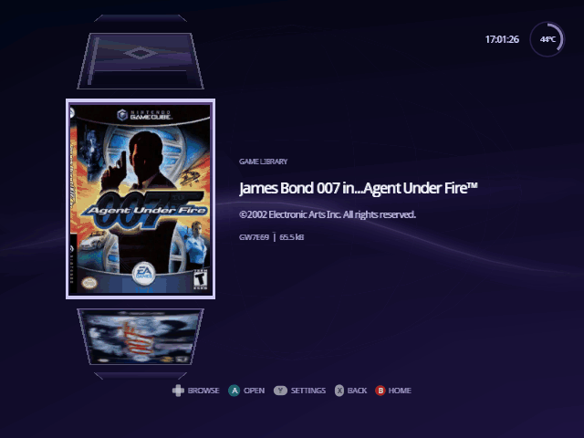
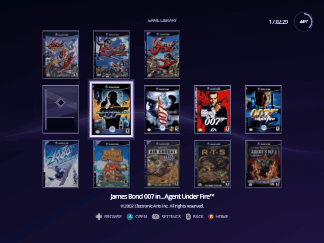
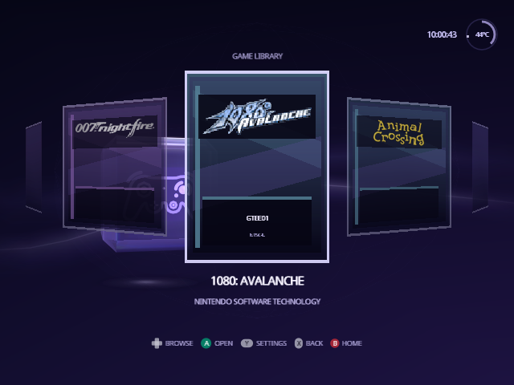

[Indigo guide](README.md) › Library

# Library

The Library shows the games on your card as posters: in a row, in a column
or in a grid, as you choose. On Home, turn the cube to **Library** and press
A.

<p align="center">
  
</p>

## Choose a layout

**Library Layout**, the first row of [Settings](settings.md) › Setup ›
Library, sets how the Library lays out your games. Left and Right on it step
through the three, and the line above the buttons says how each one moves.

<p align="center">
  
</p>

- **Horizontal**, the default: a row of covers. The game in the middle is
  raised, with its title and publisher underneath, as the disc's own banner
  gives them.
- **Vertical**: a column of covers down the left of the screen, turning like
  a wheel. The selected cover is large, with its title, publisher and game ID
  beside it.
- **Grid**: rows of five covers, three rows on screen. The selected cover is
  lit and a little larger, and its title and publisher are shown above the
  controls.

<p align="center">
  
</p>

<p align="center">
  
</p>

Every layout wraps round: after the last game comes the first.

## Moving around

| To move | Horizontal | Vertical | Grid |
| --- | --- | --- | --- |
| To the next or previous game | Left, Right | Up, Down | Left, Right |
| To the game above or below | | | Up, Down |
| A page at a time | Up, Down, L, R | Left, Right, L, R | L, R |

The control stick moves along the layout too, and in the grid in every
direction. A page is nine games, or three rows of the grid; it stops at the
first or last game (or row) before it wraps round.

In the grid, Left and Right run on from the end of one row to the start of
the next. Up and Down keep to the column. The last row can be short: from a
column it doesn't have, Up or Down lands on its last game.

- **A** opens the game's [details](game-details.md), where you launch it.
- **Y** opens the game's [own settings](game-details.md#this-games-own-settings),
  as X does on its details. When you leave them you are on the game's
  details, and B takes you back to the Library. Y never starts the game,
  even with **Boot without prompts** on.
- **B** goes back to Home.
- A small **sliders mark** in the corner of a cover means that game has
  [settings of its own](game-details.md#this-games-own-settings).

<p align="center">
  
</p>

The Library remembers where you were. Come back from a game's details, or
from Home, and the same game is still selected.

## Set up the games folder

The Library shows the games in one folder, `/games` at the root of the card
(or of whichever device you chose on [Source](source.md)). Put each game in
its own folder, or put the disc images there directly:

```text
/games/Super Mario Sunshine [GMSE01]/game.iso
/games/Super Mario Sunshine.iso
```

Disc images end in `.iso`, `.gcm`, `.tgc` or `.fdi`, in capitals or not.
Keep nothing else in `/games`: any other file (a text file, a cover image)
or an empty folder turns the Library back into Swiss's plain file list.

<p align="center">
  
</p>

If you see the list above instead of posters, look in `/games` for the file
that isn't a game. Or turn on **Hide unknown file types** in Settings ›
Setup › Library, which hides stray files so the Library can take over.

Games on two discs appear twice, once for each disc.

## Posters

The box art comes from a poster pack, which is optional. Without one, each
game shows its disc banner and its six-character game ID, such as `GMSE01`:

<p align="center">
  
</p>

Download a ready-made pack or build your own: see [Posters](posters.md).

## Read the games again

Indigo reads the games when it opens a device. If what's on it changes while
Indigo is running, for example when you swap the game disc, turn to
**Source** on Home and choose **Refresh Library**.

---

<p align="center"><a href="home.md">← Home</a> · <a href="game-details.md">Game details →</a></p>
