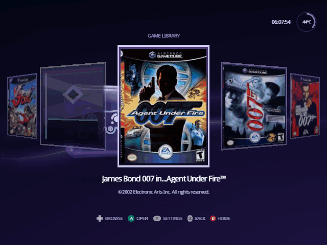
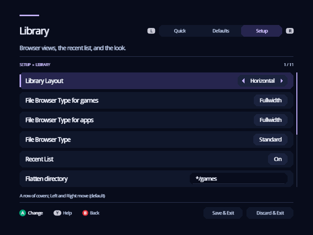
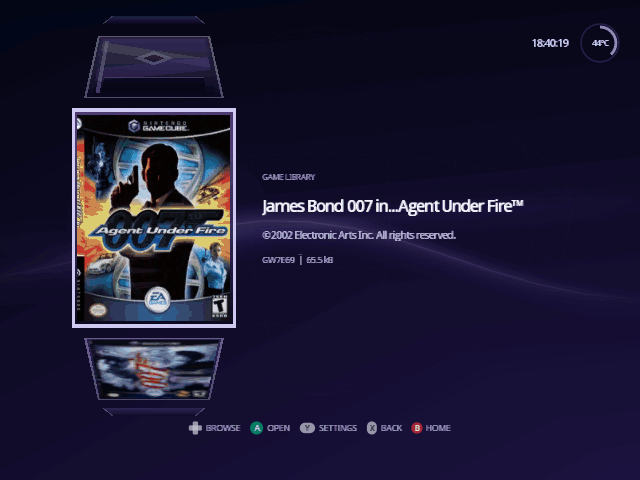
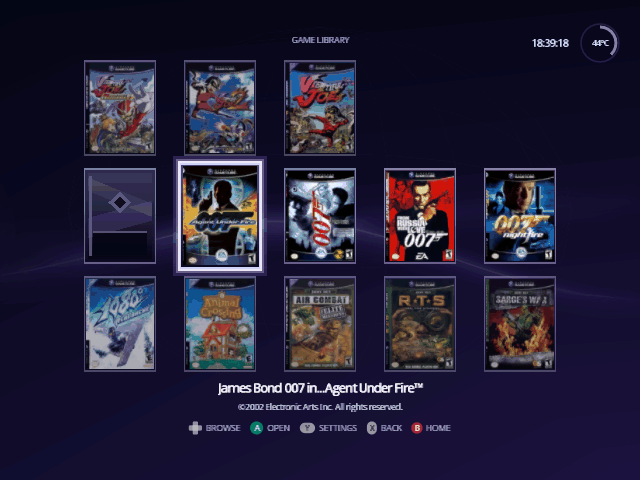
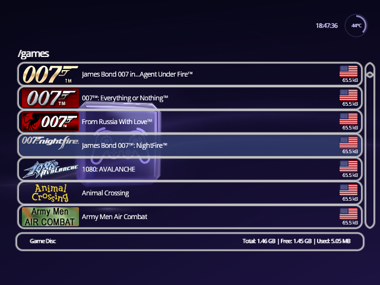
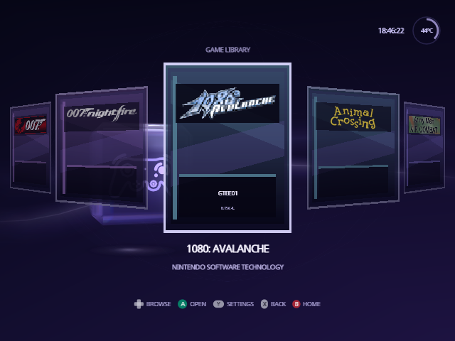

[Indigo guide](README.md) › Library

# Library

The Library shows the games on your card as posters: in a row, in a column
or in a grid, or as a gameplay still over a row of disc banners, as you
choose. On Home, turn the cube to **Library** and press A.

<p align="center">
  
</p>

## Choose a layout

**Library Layout**, the first row of [Settings](settings.md) › Setup ›
Library, sets how the Library lays out your games. Left and Right on it step
through the four, A lists them, and the line above the buttons says how each
one moves.

<p align="center">
  
</p>

- **Horizontal**, the default: a row of covers, two either side of the
  game in the middle. That one is raised, with its title and publisher
  underneath, as the disc's own banner gives them.
- **Vertical**: a column of covers down the left of the screen, turning like
  a wheel. The selected cover is large, with its title, publisher and game ID
  beside it.
- **Grid**: rows of five covers, three rows on screen. The selected cover is
  lit and a little larger, and its title and publisher are shown above the
  controls.
- **Spotlight**: the selected game's gameplay still, large, with its title,
  publisher, a description and its game ID beside it, over a row of disc
  banners: the selected game's in the middle, a little larger, and two
  either side. The still comes from the
  [stills pack](posters.md#gameplay-stills); a game without one shows its
  cover there, or its banner card. The description comes from the
  [descriptions file](posters.md#game-descriptions), else from the game's
  disc banner. Spotlight's design comes from mvizensk's
  [Gameplay Spotlight](https://github.com/mvizensk/gameplay-spotlight), with their
  permission.

<p align="center">
  
</p>

<p align="center">
  
</p>

<p align="center">
  
</p>

Every layout wraps round: after the last game comes the first.

## Moving around

| To move | Horizontal, Spotlight | Vertical | Grid |
| --- | --- | --- | --- |
| To the next or previous game | Left, Right | Up, Down | Left, Right |
| To the game above or below | | | Up, Down |
| A page at a time | Up, Down, L, R | Left, Right, L, R | L, R |

The control stick moves along the layout too, and in the grid in every
direction. A page is nine games, or three rows of the grid; it stops at the
first or last game (or row) before it wraps round.

In the grid, Left and Right run on from the end of one row to the start of
the next. Up and Down keep to the column. The last row can be short: from a
column it doesn't have, Up or Down lands on its last game.

- **A** opens the game's [details](game-details.md), where you launch it.
- **Y** opens the game's [own settings](game-details.md#this-games-own-settings),
  as X does on its details. When you leave them you are on the game's
  details, and B takes you back to the Library. Y never starts the game,
  even with **Boot without prompts** on.
- **B** goes back to Home.
- A small **sliders mark** in the corner of a cover means that game has
  [settings of its own](game-details.md#this-games-own-settings).

<p align="center">
  
</p>

The Library remembers where you were. Come back from a game's details, or
from Home, and the same game is still selected.

## Set up the games folder

The Library shows the games in one folder, `/games` at the root of the card
(or of whichever device you chose on [Source](source.md)). Put each game in
its own folder, or put the disc images there directly:

```text
/games/Super Mario Sunshine [GMSE01]/game.iso
/games/Super Mario Sunshine.iso
```

Disc images end in `.iso`, `.gcm`, `.tgc` or `.fdi`, in capitals or not.
The Library skips anything else in `/games` or in a game's folder, such as a
text file, a cover image or an empty folder.
Mac metadata files whose names start with `._` are skipped too. Hidden files
in a game's folder follow **Show hidden files**, as they do in the file list.

<p align="center">
  
</p>

If `/games` holds no disc images, you get the list above instead of posters.
Compressed images (`.rvz`, `.gcz`) don't count: Swiss can't start them, and
choosing one tells you to decompress it with NKit or Dolphin.

Games on two discs appear twice, once for each disc.

## Folders of games

With **Library Folders** off (the default), the Library is one list of every
game in `/games`, however you have sorted them into folders there. To browse
by folder instead, turn on Settings › Setup › Library › **Library Folders**.
The Library then shows the folders in `/games` as cards beside the games:

```text
/games/Pikmin.iso
/games/Nintendo/Super Mario Sunshine [GMSE01]/game.iso
/games/Nintendo/Zelda/The Wind Waker.iso
/games/Nintendo/Zelda/Older/Ocarina of Time.iso
```

Here `/games` shows Pikmin and a **Nintendo** folder; Nintendo shows Super
Mario Sunshine and a **Zelda** folder.

- **A** on a folder opens it. The heading names the folder you are in, such
  as `NINTENDO / ZELDA`.
- **B**, or A on the first card, goes back up a folder; from `/games`, B goes
  back to Home.
- Folders go two levels deep. A folder in a folder is the last level: it
  shows every game below it, in folders of its own or not, so Zelda above
  shows both The Wind Waker and Ocarina of Time.
- A folder named like a game, `Title [GAMEID]`, is a game, not a folder of
  games: it shows as that game, as it does in `/games`.
- Keep a game's discs in the same folder. Indigo looks for the other disc
  next to the one you start.
- A folder with no games in it shows only the way back.

While Library Folders is on, it sets **Flatten directory** itself, and the
row can't be changed. Turn Library Folders off and your own value comes
back.

### Give a folder a picture

Put a PNG beside the folder, with the folder's name: `Nintendo.png` in
`/games` for the Nintendo folder, `Zelda.png` in `/games/Nintendo` for Zelda.
It becomes the folder's poster, made on the console the first time the
folder is shown, as an app's picture is (see
[Give an app a picture](apps.md#give-an-app-a-picture)):

- Any size up to 2048 × 2048 pixels, and up to 2 MB.
- Any PNG, but not interlaced.
- A picture shaped like a poster (3:4, such as 600 × 800) fills the card;
  any other shape sits whole in the middle of it.

A folder without a picture, or with one Indigo can't read, gets a poster of
its name. Indigo never reads a picture over 2 MB, and makes one poster at a
time, so even a very large picture can't use up the console's memory.

## Posters

The box art comes from a poster pack, which is optional. Without one, each
game shows its disc banner and its six-character game ID, such as `GMSE01`:

<p align="center">
  
</p>

Download a ready-made pack or build your own: see [Posters](posters.md).

## Read the games again

Indigo reads the games when it opens a device. If what's on it changes while
Indigo is running, for example when you swap the game disc, turn to
**Source** on Home and choose **Refresh Library**.

---

<p align="center"><a href="home.md">← Home</a> · <a href="game-details.md">Game details →</a></p>
