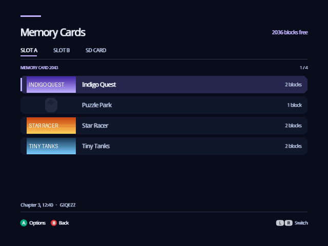
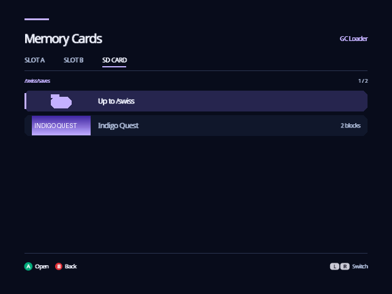
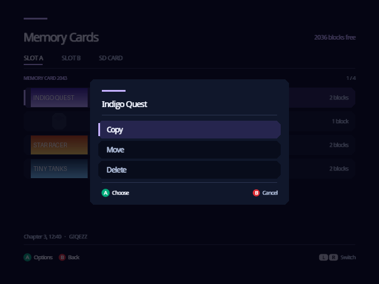
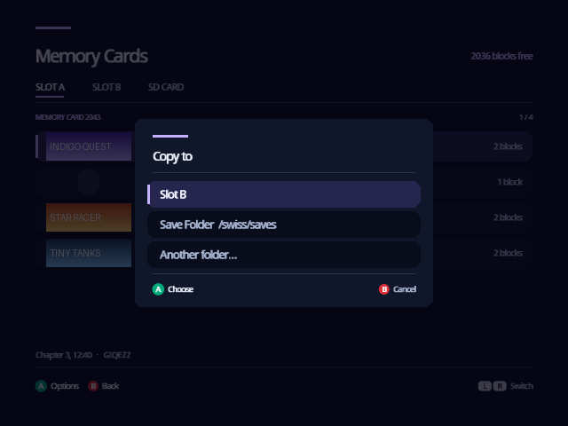
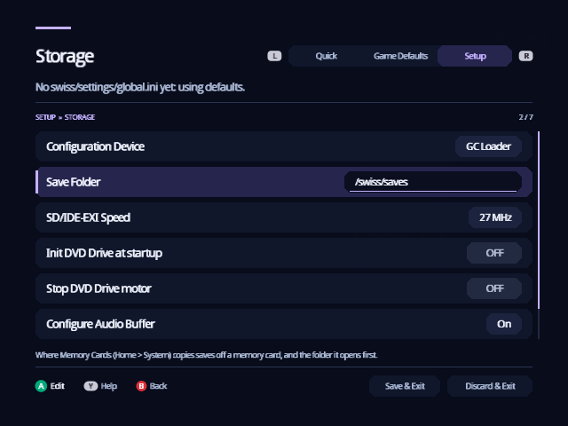
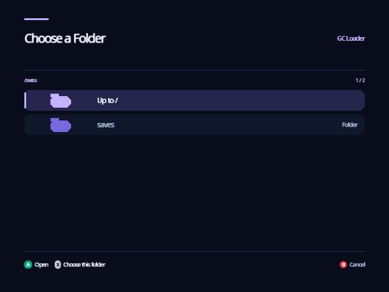

[Indigo guide](README.md) › Memory Cards

# Memory Cards

Memory Cards shows the saves on the memory cards in Slot A and Slot B, and
the saves in folders on your SD card, and moves them between the three, much
as the GameCube's own Memory Card screen does between its two slots. On Home,
turn the cube to **System**, press A, choose **Memory Cards** and press A.

  

## What's on the screen

Three tabs along the top: **SLOT A**, **SLOT B** and **SD CARD**. L and R move
between them. Memory Cards opens on Slot A.

- **A memory card's tab** lists its saves in the card's own order. Each row
  shows the save's banner, the game's name for it (the first line of its
  comment) and how many blocks it takes. The top right says how many blocks
  are free, and the line above the buttons shows the rest of the highlighted
  save's comment and its game code.
- **The SD CARD tab** opens on your Save Folder and lists its folders, then
  its saves: `.gci` files, and Action Replay (`.sav`) and GameShark (`.gcs`)
  saves. A opens a folder; the first row, **Up to**, goes back up. The SD
  card is the one Indigo keeps its settings on, the Configuration Device.

  

  

A save without a banner shows a small memory card instead. A slot with no
card, or with something else in it, says so; put a card in and press L or R
to look again.

## Copy, move and delete

Highlight a save and press **A**:

- **Copy** puts a copy somewhere else and leaves the save where it is.
- **Move** puts it somewhere else and then removes it here.
- **Delete** removes it, after you choose **Delete** a second time. Cancel is
  highlighted first, so an extra A doesn't delete anything.

  

Copy and Move then ask where to:

| Choice | Puts the save |
| --- | --- |
| Slot A, Slot B | On the memory card in that slot. Offered when the slot has a card and the save isn't already on it. |
| Save Folder | In the Save Folder on the SD card, as a `.gci`. |
| Another folder… | In a folder you choose: A opens a folder, X chooses the one that's open, B cancels. |

  

A save copied off a memory card is named the way Dolphin names the saves in
a GCI folder, such as `01-GALE-SuperSmashBros0110290334.gci`, so a folder of
them can also be a Dolphin memory card. When the name is taken, the copy is
numbered: `…_2.gci`. A save copied from a folder keeps its file name.

Indigo reads every copy back and compares it with the original before it
calls the copy done, and a Move removes the original only after that. If
anything goes wrong, the message says what, and nothing is moved.

Memory Cards won't:

- **Write over a save.** A card that already has the same save says so; delete
  one of them first.
- **Copy to a card without room.** It says how many blocks the card has free
  and how many the save needs.
- **Move a save its game marks as not to be moved.** Some games tie a save to
  its memory card, and moving it would lose it. Copy it instead: the original
  stays where it works.

## The Save Folder

Settings › Setup › Storage › **Save Folder** is where saves copied off a
memory card go, and the folder the SD CARD tab opens on. It starts as
`swiss/saves`, which Indigo makes the first time you open Memory Cards. A on
Save Folder lists the SD card's folders: A opens one, X chooses the one
that's open, and B keeps the folder you had. Leave Settings with Save & Exit
to keep your choice.

  

  

## Good to know

- Memory Cards works with memory cards in the slots. **Emulate Memory Card**
  keeps saves in a memory card image on the SD card instead, one per slot and
  region (`swiss/saves/MemoryCardA.USA.raw` and so on), which Memory Cards
  doesn't open.
- A slot holding an SD adapter that Indigo is using, for your games or its
  settings, isn't read as a memory card.
- Dolphin can't give a GameCube an SD card, so there the SD CARD tab says
  there is no device for settings and saves.

---

<a href="system.md">← System</a> · <a href="posters.md">Posters →</a>

