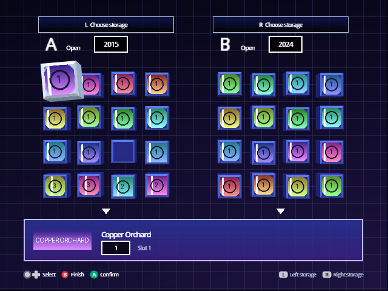
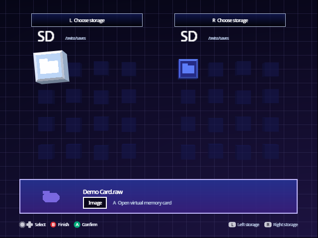
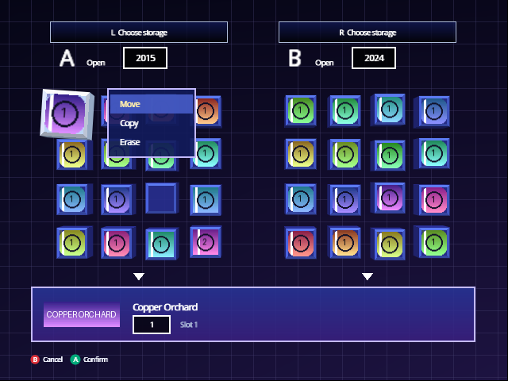
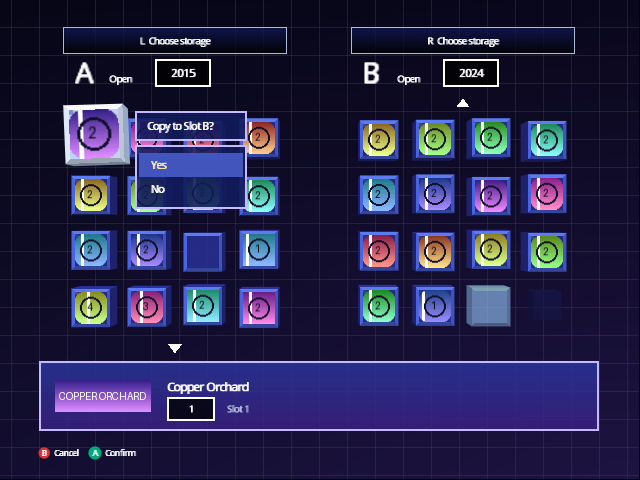
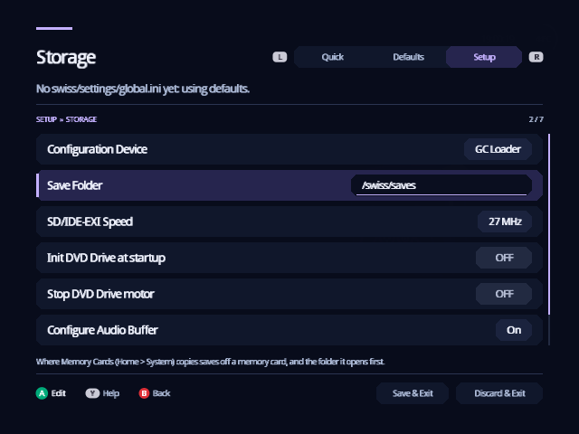
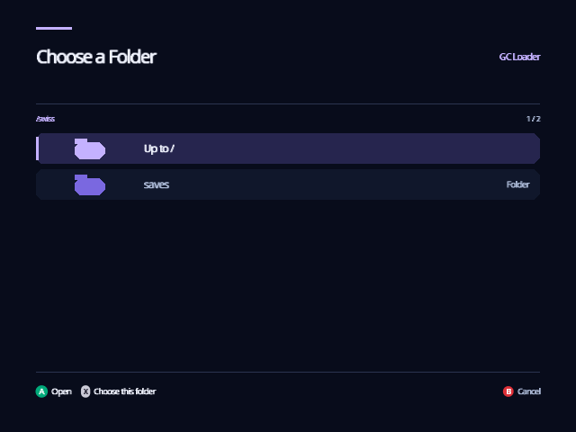

[Indigo guide](README.md) › Memory Cards

# Memory Cards

Memory Cards shows the saves on your memory cards and in folders on your SD
card the way the GameCube's own Memory Card screen shows its two slots: two
stacks of small cubes, a save to a cube, side by side. It moves, copies and
erases saves from one stack to the other. On Home, turn the cube to
**System**, press A, choose **Memory Cards** and press A.

  

## What's on the screen

Slot A's stack is on the left and Slot B's on the right, over graph paper.

- **Each save is a cube** with its game's icon on the front, animated as the
  game made it. Free space shows as smaller, see-through cubes: a card shows
  at least 16 places, and always one free place after its last save.
- **A stack shows four rows of four.** An arrow above or below it means it
  holds more rows; it scrolls a row at a time as you move.
- **Above each stack** are the slot's letter, **Open** and how many blocks
  are free, in a box.
- **The highlighted cube** is larger and pale, and sways slowly. The other
  cubes float gently, each in its own time.
- **The bar along the bottom** shows the highlighted save: its banner (or
  its icon, when it has no banner), the game's name for it (the first line
  of its comment), its size in blocks in a box, and the rest of its comment.
  For a moment after you move, a save's name is its file name, until Indigo
  has read the save. A free place leaves the bar empty.

  

A slot with no card, or with something else in it, says so in its half of
the screen, such as "Nothing is inserted in Slot B."; put a card in and
press L or R to look again. An empty card shows 16 free places.

### The SD card

**L** swaps the left stack and **R** the right one, each between Slot A,
Slot B and the SD card, passing over the place the other stack shows. Memory
Cards opens on Slot A and Slot B.

The SD card's stack shows a folder on the SD card Indigo keeps its settings
on, the Configuration Device. It opens on your Save Folder and shows its
folders, as cubes with a folder on the front, then its saves: `.gci` files,
and Action Replay (`.sav`) and GameShark (`.gcs`) saves. Its header names the
folder. A on a folder opens it, and B goes back up, as far as the folder it
opened on.

  

## Move, copy and erase

Highlight a save and press **A**. A box opens beside its cube:

- **Move** puts the save in the other stack's card or folder, then removes
  it here.
- **Copy** puts a copy there and leaves the save where it is.
- **Erase** removes it.

  

Move and Copy always go to the other stack: to put a save somewhere else,
swap that stack first with L or R. When a save can't go there, Move or Copy
is dimmed, and while it's highlighted the bar and the line below it say
why:

| The reason | Why |
| --- | --- |
| No memory card in Slot B | The other stack has no card to write to. |
| Slot B already has this save | A card is never written over: a save of the same game and name is there. Erase one of them first. |
| Slot B has 127 saves | A card holds 127 saves at most. |
| Slot B has 4 free blocks; this needs 11 | The card has too little room. |
| This game doesn't let its save move | The game ties its save to its memory card, and moving it would lose it. Copy it instead: the original stays where it works. |
| The SD card can't be written | The SD card is read-only. |

Choose Move or Copy and Memory Cards asks first, **Yes** highlighted: "Copy
to Slot B?", or "Copy to the SD card?" for the folder the SD card's stack
has open. A pale cube pulses where the save will land. When that folder
holds folders of its own, you choose instead between it and **Another
folder…**, the folder chooser: A opens a folder, X chooses the one that's
open, and B cancels. Erase asks "Erase this save?" with **No** highlighted,
so an extra A doesn't erase anything.

  

While the card is read and written, a copy of the save's cube flies to where
the save is going and waits there, and the line at the bottom reads
"Accessing. Do not touch the Memory Card or the POWER Button." Indigo reads
every copy back and compares it with the original before it calls the copy
done, and a Move removes the original only after that. Then the cube lands,
the saves after one that moved away or was erased slide along to close the
gap, and a maroon box says "Finished copying.", "Finished moving." or "The
data was erased." It closes by itself after two seconds, or press A or B.
An erased save's cube shrinks and bursts into pieces.

If anything goes wrong, the cube flies back, and a message says what went
wrong and that nothing was changed or moved; press A.

A save copied off a memory card is named the way Dolphin names the saves in
a GCI folder, such as `01-GALE-SuperSmashBros0110290334.gci`, so a folder of
them can also be a Dolphin memory card. When the name is taken, the copy is
numbered: `…_2.gci`. A save copied from a folder keeps its file name.

## The Save Folder

Settings › Setup › Storage › **Save Folder** is the folder the SD card's
stack opens on, so it's where saves copied off a memory card go unless you
open another folder first. It starts as `swiss/saves`, which Indigo makes
the first time you open Memory Cards. A on Save Folder lists the SD card's folders: A
opens one, X chooses the one that's open, and B keeps the folder you had.
Leave Settings with Save & Exit to keep your choice.

  

  

## Good to know

- The cubes take your Menu Color and the graph paper your Backdrop Color.
  With UI Motion on Reduced the cubes don't float, the highlighted one sways
  less and a copy glides straight across; with Off nothing moves, icons
  included.
- Memory Cards doesn't format a card. A card that can't be read says so;
  the GameCube's own Memory Card screen can check or format it.
- Memory Cards works with memory cards in the slots. **Emulate Memory Card**
  keeps saves in a memory card image on the SD card instead, one per slot and
  region (`swiss/saves/MemoryCardA.USA.raw` and so on), which Memory Cards
  doesn't open.
- A slot holding an SD adapter that Indigo is using, for your games or its
  settings, isn't read as a memory card.
- Dolphin can't give a GameCube an SD card, so there the SD card's stack
  says there is no device for settings and saves.

---

<a href="system.md">← System</a> · <a href="posters.md">Posters →</a>

