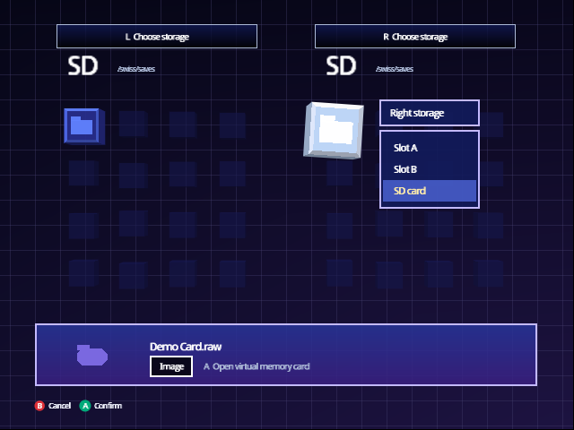
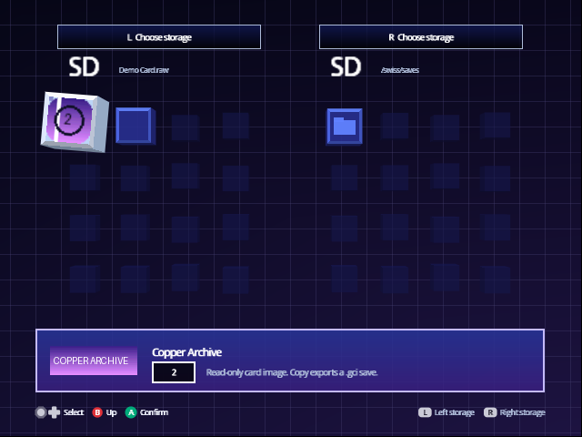
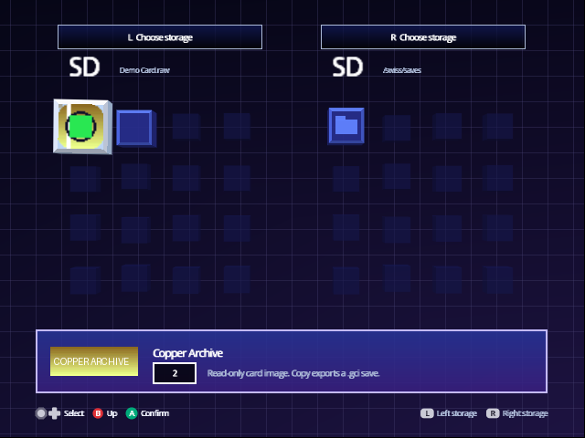
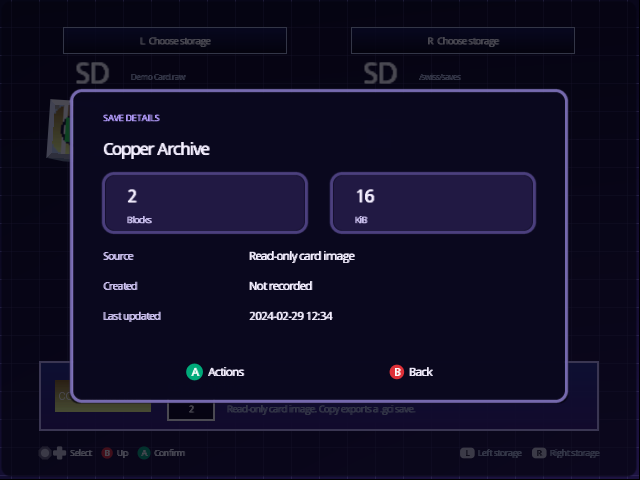
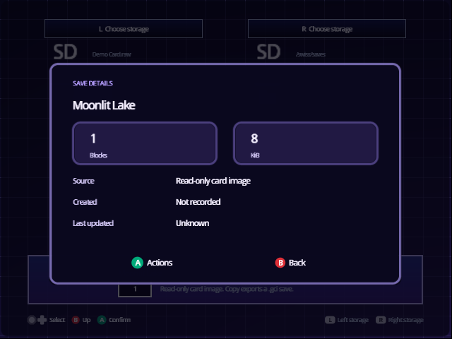
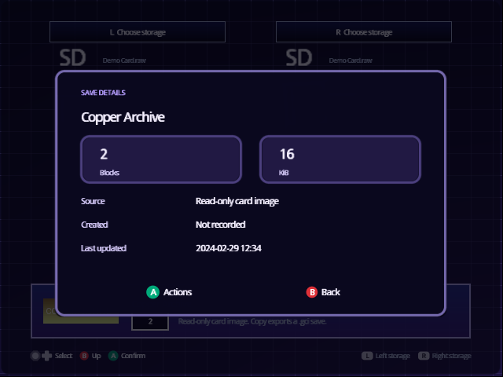

[Indigo guide](README.md) › Memory Cards

# Memory Cards

Memory Cards shows the saves on your memory cards and in folders on your SD
card the way the GameCube's own Memory Card screen shows its two slots: two
stacks of small cubes, a save to a cube, side by side. It moves, copies and
erases saves from one stack to the other. On Home, turn the cube to
**System**, press A, choose **Memory Cards** and press A.

  

## What's on the screen

Each stack shows a storage location, over graph paper. It opens on Slot A
and Slot B when cards are inserted; an absent card opens that column on SD
instead, when the Configuration Device is available.

- **Each save is a cube** with its game's icon on the front, animated as the
  game made it. The cube edges stay smooth as they float and turn. Free space
  shows as smaller, see-through cubes: a card shows at least 16 places, and
  always one free place after its last save.
- **A stack shows four rows of four.** An arrow above or below it means it
  holds more rows; it scrolls a row at a time as you move.
- **Above each stack** is a permanent **L Choose storage** or **R Choose
  storage** button. Below it are the slot's letter, **Open** and free blocks,
  or the SD folder or virtual card's name.
- **The highlighted cube** is larger and pale, and sways slowly. The other
  cubes float gently, each in its own time.
- **The bar along the bottom** shows the highlighted save: its banner (or
  its icon, when it has no banner), the game's name for it (the first line
  of its comment), its size in blocks in a box, and the rest of its comment.
  For a moment after you move, a save's name is its file name, until Indigo
  has read the save. A free place leaves the bar empty.

  

A slot with no card, or with something else in it, says so in its half of
the screen, such as "Nothing is inserted in Slot B."; put a card in and
press L or R, choose that slot and press A to look again. An empty card
shows 16 free places.

### The SD card

**L** opens **Left storage** and **R** opens **Right storage**. Choose
**Slot A**, **Slot B** or **SD card**, then press A; B cancels. A physical
slot already shown in the other column is dimmed. Both columns can show SD,
with independent folder positions, so no physical memory card is needed to
browse virtual cards and export saves.

  

The SD card's stack shows a folder on the SD card Indigo keeps its settings
on, the Configuration Device. It opens on your Save Folder and shows its
folders, as cubes with a folder on the front, then its saves: `.gci` files,
and Action Replay (`.sav`) and GameShark (`.gcs`) saves, plus `.raw` virtual
memory cards. Its header names the
folder. A on a folder opens it, and B, with the cursor on that stack, goes
back up, as far as the folder it opened on.

  

### Virtual memory cards

Swiss's **Emulate Memory Card** keeps saves in `.raw` images such as
`swiss/saves/MemoryCardA.USA.raw`. These appear as folder cubes. Press **A**
to open an image and browse its saves and animated icons; **B** returns to
the containing folder. An unformatted or damaged image gets a clear message
and is left unchanged.

Images are read-only. With the other column on an SD folder, highlight a
save, press **A** to see its details, then **A Actions** and choose **Copy**
to export it as a `.gci` file. Move
and Erase are dimmed; importing into, formatting or repairing an image is
not offered. The exported file is read back and compared before the copy
is reported as finished.

  

  

## Save details

Highlight a save and press **A** to open its details. This works even when
both columns show read-only card images and no action can be used. The save
name is the headline; separate **Blocks** and **KiB** summaries sit above
aligned source and date rows. Unreadable headers mark the size as estimated.

- **Size** shows blocks and KiB. One block is 8 KiB of save data; the GCI
  wrapper and a RAW image's system blocks aren't part of that size.
- **Created: Not recorded** is explicit because GameCube saves don't store
  a separate creation date.
- **Last updated** shows the date recorded in the save, or **Unknown** when
  it has no usable date. It uses the console's recorded clock without
  assuming a time zone. The SD file's dates aren't substituted for it.
- **Source** names the physical slot, SD save or read-only card image.

Press **B Back** to return without changing anything, or **A Actions** to
open Move, Copy and Erase. A dimmed action always explains why it can't be
used.

  

A save without a recorded update date shows **Unknown**. The dialog remains
available when both columns hold read-only RAW images.

  

  

## Move, copy and erase

From save details, press **A Actions**. A box opens beside its cube:

- **Move** puts the save in the other stack's card or folder, then removes
  it here.
- **Copy** puts a copy there and leaves the save where it is.
- **Erase** removes it.

  

Move and Copy always go to the other stack: to put a save somewhere else,
choose that stack's storage first with L or R. When a save can't go there, Move or Copy
is dimmed, and while it's highlighted the bar and the line below it say
why:

| The reason | Why |
| --- | --- |
| No memory card in Slot B | The other stack has no card to write to. |
| Slot B already has this save | A card is never written over: a save of the same game, maker and name is there. Erase one of them first. |
| Slot B has 127 saves | A card holds 127 saves at most. |
| Slot B has 4 free blocks; this needs 11 | The card has too little room. |
| This game doesn't let its save move | The game ties its save to its memory card, and moving it would lose it. Copy it instead: the original stays where it works. |
| The SD card can't be written | The SD card is read-only. |

Saves with the same name from different games or makers are separate saves:
Copy, Move and Erase act on the one highlighted. A damaged save header with
a wildcard game or maker code cannot be copied to a memory card; an SD
save with such a header is not offered as an import. An entry with such a
code on a memory card cannot be read or erased safely and is left untouched.

Choose Move or Copy and Memory Cards asks first, **Yes** highlighted: "Copy
to Slot B?", or "Copy to the SD card?" for the folder the SD card's stack
has open. A pale cube pulses where the save will land. When that folder
holds folders of its own, you choose instead between it and **Another
folder…**, the folder chooser: A opens a folder, X chooses the one that's
open, and B cancels. Erase asks "Erase this save?" with **No** highlighted,
so an extra A doesn't erase anything.

  

While the card is read and written, a copy of the save's cube flies to where
the save is going and waits there, and the line at the bottom reads
"Accessing. Do not touch the Memory Card or the POWER Button." Indigo reads
every copy back and compares it with the original before it calls the copy
done, and a Move removes the original only after that. Then the cube lands,
the saves after one that moved away or was erased slide along to close the
gap, and a maroon box says "Finished copying.", "Finished moving." or "The
data was erased." It closes by itself after two seconds, or press A or B.
An erased save's cube shrinks and bursts into pieces.

If anything goes wrong, the cube flies back, and a message says what went
wrong and that nothing was changed or moved; press A.

A save copied off a memory card or exported from an image is named the way Dolphin names the saves in
a GCI folder, such as `01-GALE-SuperSmashBros0110290334.gci`, so a folder of
them can also be a Dolphin memory card. When the name is taken, the copy is
numbered: `…_2.gci`. A save copied from a folder keeps its file name.

## The Save Folder

Settings › Setup › Storage › **Save Folder** is the folder the SD card's
stack opens on, so it's where saves copied off a memory card go unless you
open another folder first. It starts as `swiss/saves`, which Indigo makes
the first time you open Memory Cards. A on Save Folder lists the SD card's folders: A
opens one, X chooses the one that's open, and B keeps the folder you had.
Leave Settings with Save & Exit to keep your choice.

  

  

## Good to know

- The cubes take your Menu Color and the graph paper your Backdrop Color.
  With UI Motion on Reduced the cubes don't float, the highlighted one sways
  less and a copy glides straight across; with Off nothing moves, icons
  included.
- Memory Cards doesn't format a card. A card that can't be read says so;
  the GameCube's own Memory Card screen can check or format it.
- A slot holding an SD adapter that Indigo is using, for your games or its
  settings, isn't read as a memory card.

---

<a href="system.md">← System</a> · <a href="posters.md">Posters →</a>

