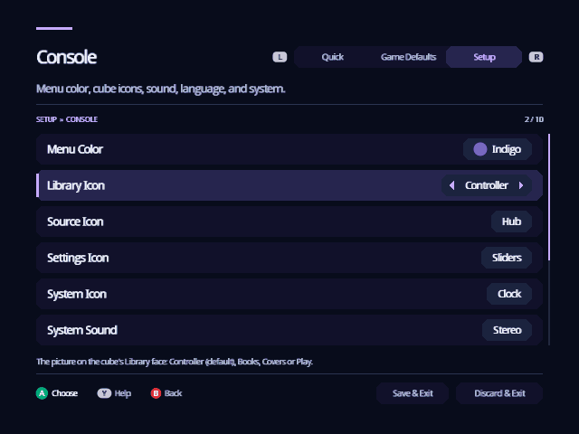

[Indigo guide](README.md) › Make it yours

# Make it yours

Indigo's look is yours to change: the color of the whole interface, the
picture on each face of the cube, how much it moves, and whether it plays
music. Everything here is in Settings, and Discard & Exit undoes it.

## Menu Color

Settings › Setup › Console › **Menu Color** recolors the cube, its light and
the stage behind it, the panels, the highlight and the text. There are eight:
**Indigo** (the default), Azure, Emerald, Gold, Spice, Crimson, Rose and
Jet Black. Indigo, Spice and Jet Black are GameCube colors.

  

Right steps round the colors one at a time. **A** lists all eight, and the
whole screen takes each color as you move through the list, so you see it
before you choose. B keeps the color you had; A chooses the one you're on.

  

Every color keeps Indigo's brightness, so text stays as easy to read. Cover
art, disc banners, the controller buttons in the hints, warnings and cheats
that are on keep their own colors.

## Cube icons

Each face of the Home cube shows a picture, and you can pick it:
Settings › Setup › Console has **Library Icon**, **Source Icon**, **Settings
Icon** and **System Icon**. Each face has four icons of its own, so no two
faces can show the same one, and A lists them. Home shows your choice as
soon as you leave Settings.

  

| Face | Its icons (it starts with the first) |
| --- | --- |
| Library | Controller, Books, Covers, Play |
| Source | Hub, Disc, SD Card, Folder |
| Settings | Sliders, Gear, Toggles, Dial |
| System | Clock, Info, Power, Chip |

A face keeps its name and what A does there. The Controller follows your
controller, and the Clock tells the time.

## Motion

Settings › Quick › **UI Motion**:

- **Full**: calm movement and ambient detail. The cube sways, the backdrop
  drifts, and the Library face's controller plays by itself when you leave
  it alone.
- **Reduced**: quicker transitions without the decorative movement.
- **Off**: everything moves instantly.

Motion never delays your input: Indigo acts on a press at once, even in the
middle of an animation.

Two more in Settings › Setup › Library: **Animated Backdrop** keeps the
backdrop still when it's off, and **Panel Transparency** makes the panels
solid instead of letting the backdrop show through.

## Music and sounds

Settings › Quick has **Menu Music**, Indigo's own ambient loop, and **Menu
Sounds**, the soft sounds as you move and choose. Music changes the moment
you switch it.

---

<a href="settings.md">← Settings</a> · <a href="source.md">Source →</a>

