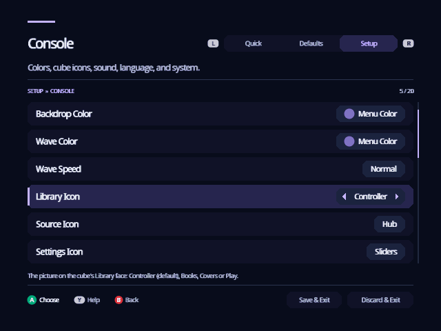

[Indigo guide](README.md) › Make it yours

# Make it yours

Indigo's look is yours to change: the color of the whole interface, the
picture on each face of the cube, how much it moves, and whether it plays
music. Everything here is in Settings, and Discard & Exit undoes it.

## Menu Color

Settings › Setup › Console › **Menu Color** recolors the cube, its light and
the stage behind it, the panels, the highlight and the text. There are eight:
**Indigo** (the default), Azure, Emerald, Gold, Spice, Crimson, Rose and
Jet Black. Indigo, Spice and Jet Black are GameCube colors.

  

Right steps round the colors one at a time. **A** lists all eight, and the
whole screen takes each color as you move through the list, so you see it
before you choose. B keeps the color you had; A chooses the one you're on.

  

Every color keeps Indigo's brightness, so text stays as easy to read. Cover
art, disc banners, the controller buttons in the hints, warnings and cheats
that are on keep their own colors.

## Backdrop and Wave Color

Under Menu Color, **Backdrop Color** colors the dark backdrop behind the cube
and its faint rings, and **Wave Color** the waves that drift in front of it.
Each is **Menu Color** by default, following Menu Color as it always has, or
one of the same eight colors to keep whatever Menu Color is. So the cube, the
backdrop and the waves can each have a color of their own: a Gold cube over
Azure waves on a Jet Black backdrop, say.

  

They work like Menu Color: Right steps round the choices, and **A** lists them
with the screen showing each one as you move through the list. The backdrop
keeps its darkness in every color, so the cube and the text stand out as
before, and Jet Black draws it nearly black.

**Wave Speed**, below them, sets how fast the waves drift: **Slow** is half
as fast, **Normal** as they always have, and **Fast** three times as fast. A
new speed picks up from where the waves are, so they never jump. **Waves**,
above Wave Color, takes them away when it's off, leaving the backdrop and its
rings.

## Cube icons

Each face of the Home cube shows a picture, and you can pick it:
Settings › Setup › Console has **Library Icon**, **Source Icon**, **Settings
Icon** and **System Icon**. Each face has four icons of its own, so no two
faces can show the same one, and A lists them. Home shows your choice as
soon as you leave Settings.

  

| Face | Its icons (it starts with the first) |
| --- | --- |
| Library | Controller, Books, Covers, Play |
| Source | Hub, Disc, SD Card, Folder |
| Settings | Sliders, Gear, Toggles, Dial |
| System | Clock, Info, Power, Chip |

A face keeps its name and what A does there. The Controller follows your
controller, and the Clock tells the time.

## Motion

Settings › Quick › **UI Motion**:

- **Full**: calm movement and ambient detail. The cube flies in when Indigo
  starts, it sways, the backdrop drifts, and the Library face's controller
  plays by itself when you leave it alone.
- **Reduced**: quicker transitions without the decorative movement. The cube
  fades in when Indigo starts instead of flying in.
- **Off**: everything moves instantly.

Motion never delays your input: Indigo acts on a press at once, even in the
middle of an animation.

Settings › Setup › Console › **Idle Animation** chooses how the cube moves
while Home rests, with UI Motion on Full: **Calm**, the slight drift it has
always had, turned a little to the right, or **Sway**, which turns it slowly
left and right, so the faces beside the one in front peek round its edges and
their icons show. After a turn the sway starts again from where the cube
rests. Over Change Source's devices the cube holds still.

Two more in Settings › Setup › Library: **Animated Backdrop** keeps the
backdrop still when it's off, and **Panel Transparency** makes the panels
solid instead of letting the backdrop show through.

## Just the cube

Settings › Setup › Console › **Face Labels** and **On-screen Controls** take
the face's name and the button hints from under the cube, for a Home with
nothing but the cube. Other screens keep their hints, and so does Restart's
question.

## Music and sounds

Settings › Quick has **Menu Music** and **Menu Sounds**, the soft sounds as
you move and choose. The music is "Up in the Sky" by Memoraphile (CC0): a
quiet intro, then a section that loops. It starts or stops the moment you
switch it, and starts again from the intro.

---

<a href="settings.md">← Settings</a> · <a href="source.md">Source →</a>

