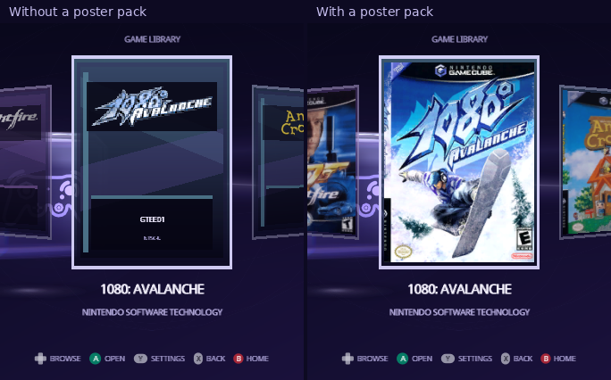

[Indigo guide](README.md) › Posters

# Posters

Posters are the box art in the [Library](library.md) and on each game's
[details](game-details.md). They come from one file on your card,
`/swiss/ui/posters.pak`. It's optional: without it, each game shows its disc
banner and its six-character game ID.

<p align="center">
  
</p>

## Download a pack

Ready-made packs are made from GameTDB's cover art:

- [Posters: every region](https://indigo.norvitech.com/indigo-posters-all.zip), for games from any region
- [Posters: USA & Japan](https://indigo.norvitech.com/indigo-posters-ntsc.zip) (NTSC)
- [Posters: Europe & Australia](https://indigo.norvitech.com/indigo-posters-pal.zip) (PAL)

Unzip the one you want into the root of the card; it holds
`swiss/ui/posters.pak`. Indigo reads one pack at a time. The every-region
pack covers every game GameTDB has art for; the regional packs are smaller,
and are the ones Indigo 2.0 and earlier can read. Checksums are in
[SHA256SUMS.txt](https://indigo.norvitech.com/SHA256SUMS.txt), and the
[Indigo page](https://norvitech.com/indigo/) has the details.

A game gets its poster when its game ID is in the pack. With a regional pack,
games from the other region keep their banner card, as do the few games
GameTDB has no art for.

## Build your own pack

You can make a pack from your own cover images, from this repository:

1. Put the front covers in one folder, each named after its game ID, such as
   `GMSE01.png` or `GALE01.jpg`, each at least 192×256: a smaller one
   stops the build and names the file. Indigo crops them to 3:4 from the
   center.
2. Build the pack. You need Python with Pillow, and Docker for the texture
   converter:

   ```bash
   python3 -m pip install pillow
   docker pull ghcr.io/extremscorner/libogc2@sha256:e6531ecaa458d0b5d8c9ba57cee1facc5fb9120808c6d9eebb2c05e4ffaf6f0f
   python3 buildtools/ui/poster_pack.py --covers ~/covers --out posters.pak
   ```

   Files that aren't named by a game ID are skipped and listed.
3. Copy `posters.pak` to `/swiss/ui/posters.pak` on the card.

A pack holds up to 2,048 covers. Indigo 2.0 and earlier read up to 1,024 and
show banners with a bigger pack.

## Gameplay stills

The **Spotlight** layout (Settings › Setup › Library › Library Layout) shows
the selected game's gameplay still, a 320×240 screenshot, from a second file
next to the posters, `/swiss/ui/stills.pak`. It's optional too: without it,
or for a game it has no still for, Spotlight shows the game's cover instead.
The ready-made downloads above carry both files, so unzipping one gives you
posters and stills together. The stills come from the
[libretro-thumbnails](https://github.com/libretro-thumbnails/Nintendo_-_GameCube)
project's GameCube screenshots.

To build your own, put screenshots in one folder, each named after its game
ID and at least 320×240 (Dolphin saves one with F9), and build the pack as
you would posters:

```bash
python3 buildtools/ui/poster_pack.py --stills ~/screenshots --out stills.pak
```

Screenshots are cropped to 4:3 from the center. Copy `stills.pak` to
`/swiss/ui/stills.pak` on the card.

## Game descriptions

Spotlight shows a few sentences about the selected game beside its still.
They come from `/swiss/ui/descriptions.txt`, which the ready-made downloads
carry too: English descriptions from [GameTDB](https://www.gametdb.com/), for
every game it knows. Without the file, or for a game it doesn't list,
Spotlight shows the description from the game's disc banner.

It's a text file you can edit: one game per line, its game ID, a space, then
the description. Add lines for games it doesn't know, such as homebrew or a
translation. The format is in [PACKS.md](../PACKS.md#game-descriptions).

## Where the game ID comes from

Every GameCube disc has a six-character ID: four for the game and region, two
for the publisher. Super Mario Sunshine for North America is `GMSE01`. A game
without a poster shows its ID on its card, and you can look up any game's ID
on [GameTDB](https://www.gametdb.com/).

---

<p align="center"><a href="memory-cards.md">← Memory Cards</a> · <a href="apps.md">Apps →</a></p>
