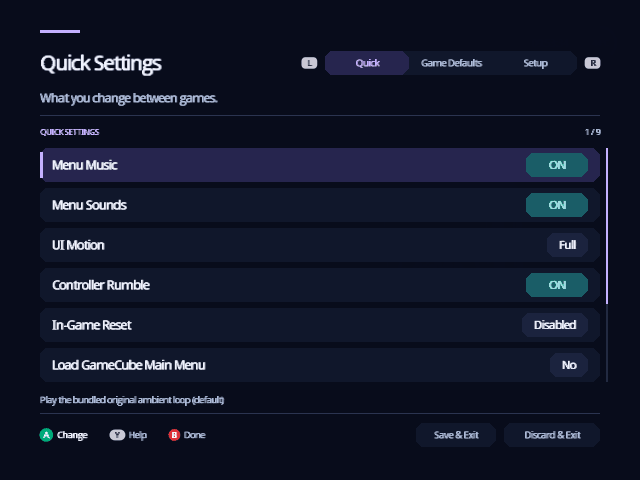
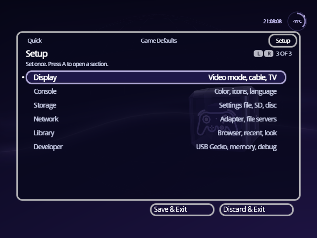
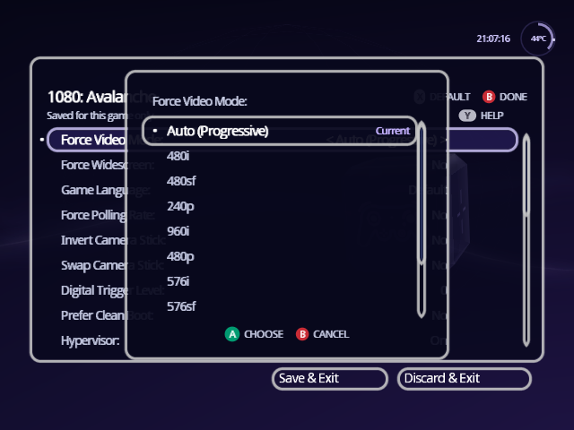
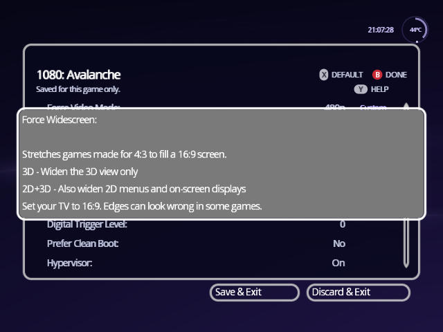
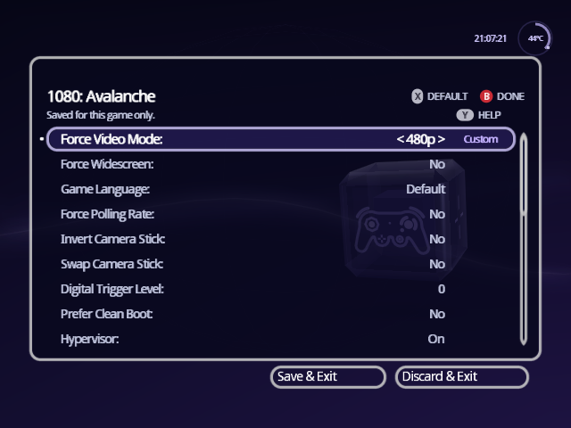

[Indigo guide](README.md) › Settings

# Settings

Settings opens on the things you change between games, keeps what every game
starts with on a second tab, and tucks the settings you set once into a
third. On Home, turn the cube to **Settings** and press A.

<p align="center">
  
</p>

- [The three tabs](#the-three-tabs)
- [Change a setting](#change-a-setting)
- [Leave: keep or discard](#leave-keep-or-discard)
- [Video changes ask first](#video-changes-ask-first)
- [A game's own settings](#a-games-own-settings)
- [Where settings are saved](#where-settings-are-saved)
- [Every setting](#every-setting)

## The three tabs

**L** and **R** move between the tabs; the top right shows which one you're
on, "1 of 3" to "3 of 3".

| Tab | Holds |
| --- | --- |
| **Quick** | Nine settings you might change any day: menu music and sounds, UI motion, rumble, In-Game Reset, the GameCube main menu, memory card emulation, auto-loaded cheats and booting without prompts. |
| **Game Defaults** | What every game starts with: video modes, widescreen, polling rate, the camera stick, compatibility and picture options. A game's own settings can differ from these. |
| **Setup** | Everything you set once, in six sections: Display, Console, Storage, Network, Library and Developer. A opens a section and B goes back to the list. |

<p align="center">
  
</p>

## Change a setting

- **Up and Down** move between settings. Hold to scroll.
- **Left and Right** step the highlighted setting to its previous or next
  value, with the change on screen at once.
- **A** changes it too.
- **Y** explains the highlighted setting. Every setting has help; Y again
  closes it.

On a setting with four or more choices, such as a video mode or a language,
A lists them all instead. Move to a choice and press A, or press B to keep
what you had. The list holds only the choices your setup can use; video
modes your cable can't show stay out of it.

<p align="center">
  
</p>

<p align="center">
  
</p>

A dimmed setting doesn't apply to your setup right now, such as IPv4 Address
while DHCP is on.

## Leave: keep or discard

- **B** leaves Settings and keeps your changes, the same as **Save & Exit**.
- **Discard & Exit** puts back everything you changed since you opened
  Settings, including Menu Color.

Both buttons sit under the list; move down past the last setting to reach
them. In a Setup section, B first goes back to the list of sections.

## Video changes ask first

After you change **Swiss Video Mode**, **System Video**, **AVE
Compatibility**, **Force DTV Status** or **RetroTINK-4K HDMI Input**,
Indigo shows the new picture and asks whether to keep it:

```text
Keep Swiss Video Mode: PAL 576i?
It changes back by itself in 10 s.
(A) KEEP    (B) CHANGE BACK
```

Press **A** to keep it. Press **B**, or just wait, and the old mode comes
back: if your TV can't show the new one, you only have to wait ten seconds.

## A game's own settings

Each game can have its own video mode, widescreen, language, polling rate and
the rest. Open them with **X** on the game's [details](game-details.md).

<p align="center">
  
</p>

- The title is the game's name, with "Saved for this game only" under it.
- A setting you change is marked **Custom**. Everything else follows Game
  Defaults, and changes when they do.
- **X** puts the highlighted setting back to its Game Defaults value.
- **B** is Done. The game's details then count its custom settings.
- **Reset to defaults**, at the end of the list, clears them all. It asks
  first, and keeps the game's Comment and Status lines in its file.

Indigo writes only the settings that differ to
`/swiss/settings/game/<ID4>.ini`, where `<ID4>` is the first four characters
of the game ID. Discs and revisions that share them share the file.

## Where settings are saved

Settings live in `/swiss/settings/global.ini` on the **configuration
device**, usually your SD card. Settings › Setup › Storage shows which device
that is, and the line under its title tells you whether the file loaded:

- "Settings are saved in swiss/settings/global.ini."
- "No swiss/settings/global.ini yet: using defaults."
- "No device to save settings to."

To change the device, set **Configuration Device** in Storage and leave with
Save & Exit. The console keeps the new choice only once the settings are
written there.

You can also write the file on a computer before you boot: every key and
value is in [Settings files](../SETTINGS.md). When Indigo saves, it keeps
your comments and any lines it doesn't know.

## Every setting

Press Y on any row for the same explanations on the console.

<details>
<summary><b>Quick</b></summary>

| Setting | What it does |
| --- | --- |
| Menu Music | Indigo's ambient music loop. Changes at once. |
| Menu Sounds | The soft sounds as you move and choose. |
| UI Motion | **Full**: calm motion and ambient detail. **Reduced**: faster transitions, no decorative movement. **Off**: everything moves instantly. |
| Controller Rumble | Whether controllers can rumble in games. |
| In-Game Reset | **Reboot** or **Apploader** lets you leave a game with A + Z + START (R + Z + START restarts it). Apploader needs `/swiss/patches/apploader.img`. |
| Load GameCube Main Menu | Starts games through the GameCube logo and main menu, with patches applied. |
| Emulate Memory Card | Games save to a memory card image on the device they start from, instead of a real memory card. Needs a device that supports it. |
| Auto-load cheats | Applies a game's saved cheats every time it starts. See [Cheats](cheats.md#start-with-your-cheats-every-time). |
| Boot without prompts | Starts a game as soon as you choose it, without its detail screen. Hold B while choosing to see the screen. |

</details>

<details>
<summary><b>Game Defaults</b> (and a game's own settings)</summary>

| Setting | What it does |
| --- | --- |
| Force NTSC Video Mode, Force PAL Video Mode | The video mode games start in. Auto keeps each game's own mode. A game's own settings have one row, **Force Video Mode**. |
| Game Language | *Game's own settings only.* The language the game uses; Default follows System Language. Matters most for PAL games. |
| Force Widescreen | Stretches games made for 4:3 to 16:9. **3D** widens the 3D view; **2D+3D** also widens menus. Set your TV to 16:9. |
| Force Polling Rate | How often the game reads the controller. **VSync** is the most compatible; **1000Hz** has the least delay. |
| Invert Camera Stick | Inverts the C-stick's X axis, Y axis or both. |
| Swap Camera Stick | Swaps the C-stick's axes with the control stick's. |
| Digital Trigger Level | How far L and R travel before they count as fully pressed. |
| Prefer Clean Boot | Resets the console and starts the game with nothing changed. Region restrictions apply. Disc drive and drive replacements only. |
| Hypervisor | Features and fixes that rely on Swiss's hypervisor. Off turns them all off. |
| Emulate Read Speed | Slows loading to match the GameCube (or Wii) disc drive, for games that rely on it and for speedrunning. |
| Emulate Audio Streaming | Plays the background audio some games stream from the disc, for devices that can't stream it. |
| Emulate Broadband Adapter | Gives the game a network adapter over a file server or network module, where memory allows. |
| Disable Memory Card | Hides the memory card in slot A or B from the game, for games that misbehave with it. |
| Force Horizontal Scale | How the picture is scaled across: Auto, 1:1, fixed ratios or a fixed width. |
| Force Vertical Offset | Moves the picture up or down. Set it in a game's own settings: the Game Defaults value doesn't reach games. |
| Force Vertical Filter | The vertical blend or deflicker filter. |
| Force Field Rendering | How interlaced pictures are drawn: by field, whole frames, or TAA. |
| Fix Pixel Center | Shifts the picture by 1/24 or 1/12 of a pixel, for games drawn off the pixel grid. Swiss turns it on by itself for the few games that need it. |
| Alpha Dithering | The fine dithering the GameCube adds to blended effects. Turn it off if it shows as a dot pattern on digital video. |
| Force Anisotropic Filter | Sharper textures at an angle. It can slow some games badly; use it sparingly. |
| RetroTINK-4K Profile | The RetroTINK-4K profile to switch to for games (and in the menus). |
| Reset to defaults | Puts every setting on the screen back. It asks first. |

</details>

<details>
<summary><b>Setup › Display</b></summary>

| Setting | What it does |
| --- | --- |
| Swiss Video Mode | The video mode of Indigo's own screens. Auto picks 480p with a digital cable and otherwise follows the console's region. Asks before it keeps a change. |
| System Video | NTSC, PAL or PAL-M, mainly for the Brazilian console. |
| Screen Position | Moves the picture left or right in games. |
| AVE Compatibility | Workarounds for your video encoder or digital video mod, such as GCVideo or GCDigital. |
| Force DTV Status | **No** trusts the Digital AV Out's own cable detection; **Yes** forces it, for a hardware fault; **Region Switch** eases moving between SD and ED TV setups. |
| RetroTINK-4K HDMI Input | Optimizes the signal for a RetroTINK-4K; the help lists the firmware it needs. |
| Disable Video Patches | **Game** skips only the fixes for particular games; **All** patches no video, and forced video modes stop working. |
| Force Video Active | A workaround for GCVideo-DVI 3.0 firmware. |
| Pause for resolution change | Pauses a game for 2 seconds when its resolution changes, so your display can catch up. |

</details>

<details>
<summary><b>Setup › Console</b></summary>

| Setting | What it does |
| --- | --- |
| Menu Color | The color of the whole interface. See [Make it yours](personalize.md#menu-color). |
| Library Icon, Source Icon, Settings Icon, System Icon | The icon on each face of the Home cube. See [Make it yours](personalize.md#cube-icons). |
| System Sound | The audio output most games use: mono or stereo. |
| System Language | The language games use, mainly multi-language PAL games. |
| System Boot Mode | On development hardware, development or production mode. With GC Loader or PicoLoader on a retail console, the default skips the GameCube logo. |
| Controller Recalibration | Off skips controller recalibration, for controllers that don't follow the standard. |
| CPU Temperature Calibration | Adjust it on a cold boot so the temperature at the top right reads about room temperature. |

</details>

<details>
<summary><b>Setup › Storage</b></summary>

| Setting | What it does |
| --- | --- |
| Configuration Device | Where `global.ini` is read and saved. Kept in the console's memory once Save & Exit has written the settings there. |
| SD/IDE-EXI Speed | 27 MHz is faster; some SD cards or adapters only work at 13.5 MHz. |
| Init DVD Drive at startup | Needed for the eject button on the Panasonic Q when Indigo replaces the IPL. |
| Stop DVD Drive motor | Stops a disc that is already spinning, as after a save-game exploit. |
| Configure Audio Buffer | Audio streaming: off, only for discs known to use it, or whenever a disc asks. It takes some of the drive's cache, so loading is slower. |
| Disable MemCard PRO GameID | Stops Indigo telling a MemCard PRO in that slot which game is starting. |

</details>

<details>
<summary><b>Setup › Network</b></summary>

| Setting | What it does |
| --- | --- |
| Init network at startup | Starts the Broadband Adapter when Indigo starts. |
| IPv4 uses DHCP, IPv4 Address, Netmask, Gateway | Your router assigns the address, or you set it here. |
| FSP Host IP, Port, Password, Path MTU | A computer serving your games over FSP. |
| FTP Host IP, Port, Username, Password, PASV Mode | An FTP server with your games. Try PASV if listings stall. |
| SMB Host IP, Share, Username, Password | A computer sharing your games over SMB. |
| RetroTINK-4K Host IP, Port | A RetroTINK-4K on your network, which Indigo switches to each game's profile. |

Passwords are saved as plain text in `global.ini`.

</details>

<details>
<summary><b>Setup › Library</b></summary>

| Setting | What it does |
| --- | --- |
| File Browser Type for games, for apps, and for everything else | How Swiss's file lists look: Standard, Fullwidth or Carousel. The poster Library isn't affected. |
| Recent List | START shows recently played games. **Lazy** updates it only for new games; **Off** saves SD card writes. |
| Flatten directory | A folder pattern whose game folders are listed as if their disc images sat directly in it. The default is `*/games`. |
| Show hidden files | Lists hidden files and folders, such as `/swiss`. |
| Hide unknown file types | Hides files that aren't games, programs, music or memory card saves. It also stops a stray file hiding the Library. |
| File Management | Z in a file list opens actions to copy, move, rename or delete. |
| Panel Transparency | Translucent panels, like the GameCube menu, or solid ones. |
| Animated Backdrop | Whether the backdrop behind the cube drifts. |

</details>

<details>
<summary><b>Setup › Developer</b></summary>

| Setting | What it does |
| --- | --- |
| Enable USB Gecko | Sends debug output to a USB Gecko, and makes wiiload available. |
| Wait for USB Gecko | Waits for the computer to read the Gecko's buffer when it fills. |
| Simulated MRAM Size | Limits memory on development hardware. |
| WiiRD debugging | Starts games with the WiiRD debugger enabled and paused. It uses more memory. |

</details>

---

<p align="center"><a href="cheats.md">← Cheats</a> · <a href="personalize.md">Make it yours →</a></p>
