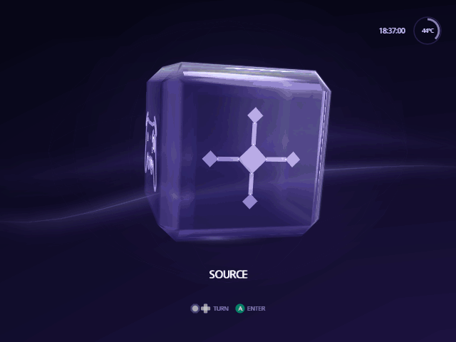

[Indigo guide](README.md) › Source

# Source

The source is the device Indigo reads your games from: the SD card, the disc
drive, a drive replacement such as GC Loader, a memory card slot or a
network share. Indigo picks one when it starts; the Source face lets you
change it.

## Change the source

1. On Home, turn the cube to **Source** and press A.
2. Choose **Change Source**. The cube lifts out of the way and the devices
   Indigo found line up under it, each with its picture.
3. Push the control stick or the D-pad **Left** or **Right** (or press **L**
   or **R**) until the device you want is in the middle, then press **A**.
   Hold the stick to keep moving; the row goes round.
4. You're back on Home, now reading from that device. Turn the cube to
   **Library** and press A to see what's on it.

  

Under the device in the middle, the picker says what it can do, where it
plugs in, and whether Indigo found it:

| It says | Meaning |
| --- | --- |
| Boot + Stream | Games start from it, with the disc audio some games stream. |
| Boot | Games start from it. |
| Files | It holds files you can browse and open. |
| Slot A, Slot B, Serial Port 1, Serial Port 2, Hi-Speed Port, Disc Drive, Console | Where it plugs in. |
| Detected | Indigo found it. |
| Not Detected | Indigo can't find it right now. A tries again. |
| Current | You're reading from it now. |
| Settings | Your settings are saved on it. |

- **Z** shows every device Indigo supports, not only the ones it found. Z
  again goes back to the ones it found.
- **Y** shows details about the device, where it has them.
- **X**, on an SD adapter or IDE-EXI device, shows its speed: Left and
  Right choose 13.5 or 27 MHz, and A keeps it. Some SD cards only work at
  the slower speed.
- **B** goes back.

The disc drive is called **Game Disc**.

## What the Library face opens

If the device has a `/games` folder holding only games, the Library face
opens the poster [Library](library.md). Otherwise it opens the
[File Browser](system.md#file-browser) at `/games`, or at the top of the
device when there is no `/games`, where you
can browse folders and open games, homebrew programs (`.dol`, `.elf`) and
MP3s:

- **A** opens a file or folder, and **X** goes up a folder.
- With **File Management** on (Settings › Setup › Library), **Z** on a file
  offers to copy, move, rename, hide or delete it. Copy and Move put it in
  the folder open in the other pane (see [File Browser](system.md#file-browser)).

While an MP3 plays, Left rewinds and Right goes forward. Rewinding near the
start returns to the start of the same track. B stops playback.

## Refresh Library

The other choice on the Source face, **Refresh Library**, reads the current
device again. Use it when what's on it changes while Indigo is running, such
as a new disc in the drive.

---

<a href="personalize.md">← Make it yours</a> · <a href="system.md">System →</a>

