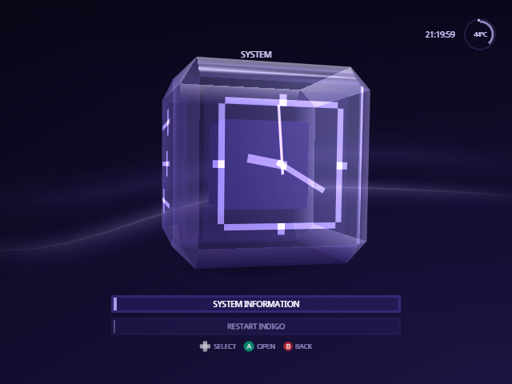
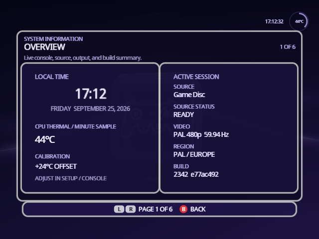
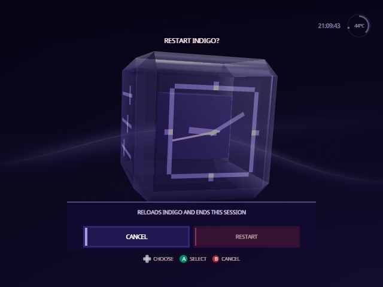

[Indigo guide](README.md) › System

# System

The System face tells you about your console and restarts Indigo. On Home,
turn the cube to **System** and press A.

  

## System Information

**System Information** is six pages about the console and the session. **L**
and **R** move between them, and **B** goes back.

  

| Page | Shows |
| --- | --- |
| **Overview** | The time and date, the CPU temperature and its calibration, and the session: the current source and whether it's ready, the video mode, the region and the build. |
| **Console** | The console model, IPL version, CPU, graphics chip and the CPU's unique ID. |
| **Connections** | What's in the memory card slots, serial ports, the disc drive interface and the high-speed port, plus a live look at the slots, the current source and the configuration device. |
| **Input / Output** | What's plugged into the four controller sockets, and the video mode, progressive scan, region, audio and language. |
| **About Indigo** | The Swiss version Indigo is built on, the exact commit and revision, where the source lives, and where to get community help. |
| **Credits** | The people who made Swiss possible. |

Connections and Input / Output are read when you open the page; open it again
to see a change.

The CPU temperature has no factory calibration. If Overview's reading is off
on a cold console, adjust Settings › Setup › Console › **CPU Temperature
Calibration** until it reads about room temperature.

## Restart Indigo

**Restart Indigo** resets the console, which then starts the way it does
after you press its Reset button. If your loader boots Indigo, as PicoBoot
does with `ipl.dol`, you're back in Indigo with a fresh session; a loader that
boots stock Swiss first starts that instead.

Indigo asks first, with **Cancel** selected, so an extra A can't restart it
by mistake. Choose **Restart** with Left or Right, then press A.

  

---

<a href="source.md">← Source</a> · <a href="posters.md">Posters →</a>

