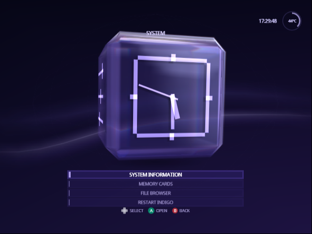
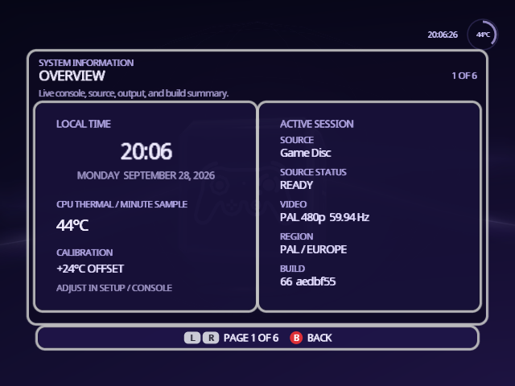
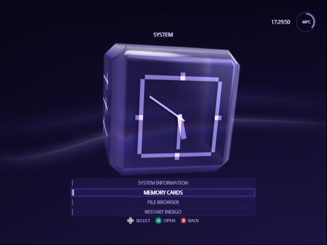
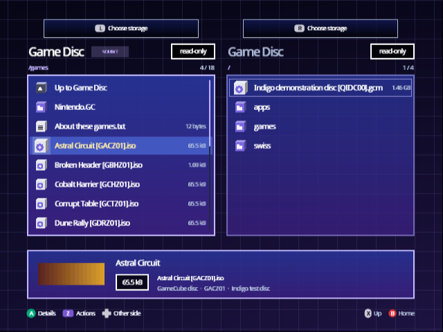
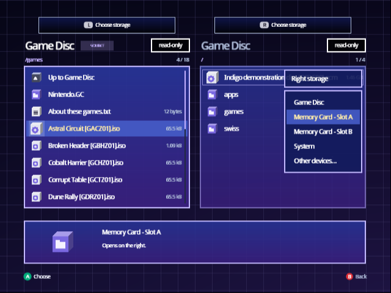
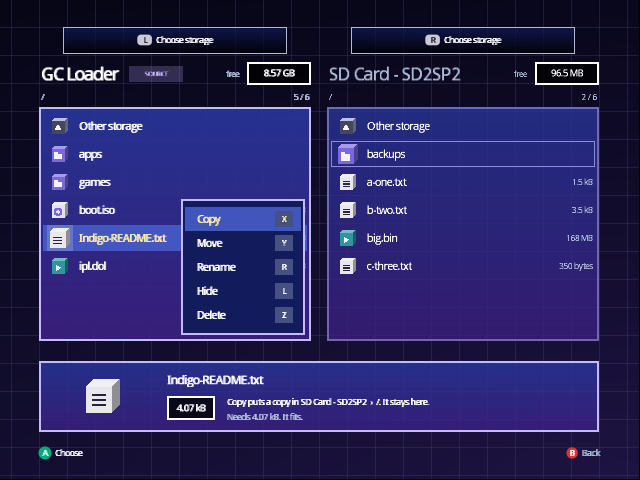
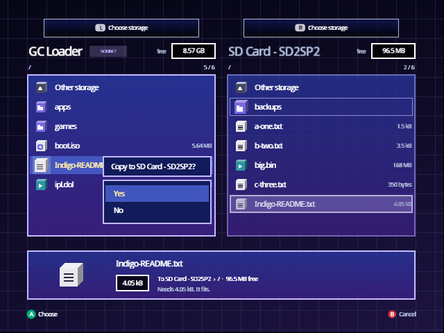
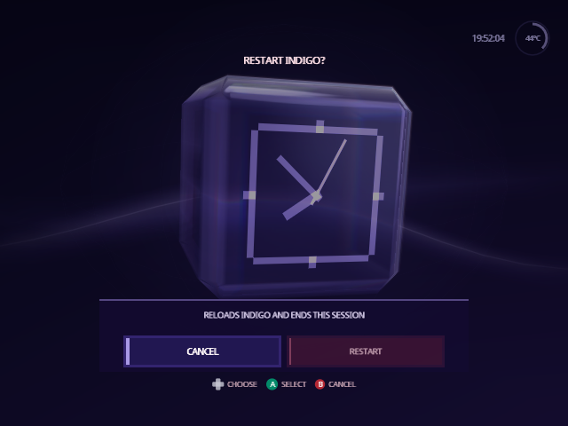

[Indigo guide](README.md) › System

# System

The System face tells you about your console, manages the saves on your
memory cards, opens the File Browser and restarts Indigo. On Home, turn
the cube to **System** and press A.

  

## System Information

**System Information** is six pages about the console and the session. **L**
and **R** move between them, and **B** goes back.

  

| Page | Shows |
| --- | --- |
| **Overview** | The time and date, the CPU temperature and its calibration, and the session: the current source and whether it's ready, the video mode, the region and the build. |
| **Console** | The console model, IPL version, CPU, graphics chip and the CPU's unique ID. |
| **Connections** | What's in the memory card slots, serial ports, the disc drive interface and the high-speed port, plus a live look at the slots, the current source and the configuration device. |
| **Input / Output** | What's plugged into the four controller sockets, and the video mode, progressive scan, region, audio and language. |
| **About Indigo** | The Swiss version Indigo is built on, the exact commit and revision, where the source lives, and where to report a bug or ask a question: Indigo's GitHub issues and discussions. |
| **Credits** | The people who made Swiss and Indigo possible, and where the Spotlight layout's design comes from: Gameplay Spotlight by mvizensk. |

Connections and Input / Output are read when you open the page; open it again
to see a change.

The CPU temperature has no factory calibration. If Overview's reading is off
on a cold console, adjust Settings › Setup › Console › **CPU Temperature
Calibration** until it reads about room temperature.

## Memory Cards

**Memory Cards** shows the saves on the memory cards in Slot A and Slot B and
in folders on your SD card as two stacks of cubes, each with its game's
icon, the way the GameCube's own Memory Card screen does, and moves, copies
and erases them from one stack to the other. See
[Memory Cards](memory-cards.md).

  

## File Browser

**File Browser** opens at the top of your source, even when your games show
in the Library, for the files the Library and Apps don't show: settings,
cheats, saves, music and anything else on the card. It can have a side of
the Home cube of its own too: Settings › Setup › Console › **Up Face** (or
Left, Right or Down Face) › File Browser; see
[Choose the sides](home.md#choose-the-sides). The same screen shows wherever
Indigo lists files outside the Library: from the Library face when there are
no games to show, from Recent, and for an Autoload folder.

  

It shows two panes side by side, as Memory Cards shows two stacks. The left
pane, marked **SOURCE**, is your source: games, programs and music start
from it. The right pane shows another folder, on the same device or on
another one. Above each pane are its device, the device's free space (or
**read-only**; nothing when the device can't say, as on a network share),
the open folder and where you are in it. Each row has a cube for what the entry is
(folders violet, disc images silver, programs teal, firmware updates amber,
music pink), the file's real name with its extension, and its size. A name
too long for the row is cut in the middle, keeping its extension and a
"(Disc 1)" before it; the info bar below shows the whole name, and for a
game its banner and title.

- **Left** and **Right** move between the panes; each keeps its place.
- **Up** and **Down** move a row, and keep going while held. The C-stick
  goes a page up or down.
- **A** opens a folder or starts a file in the left pane, and **X** or `..`
  goes up a folder. A on a game (a disc image), on storage that starts
  games, opens its [Game details](game-details.md), as in the Library: its
  cover, saves, settings, cheats and Launch Game. **B** there comes back to
  the same row.
  In the right pane, A opens folders; games start from the left. A on a file that doesn't start (a
  text file, a save, a FlippyDrive update anywhere but on the FlippyDrive)
  opens its actions.
- **L** and **R** choose the storage on each side, as in Memory Cards: **L**
  the left pane's, **R** the right pane's. **X** or `..` at the top of a
  pane does the same.
- **Y** swaps the two sides: the right pane's device and folder become your
  source, and your source moves to the right. Y again swaps them back.
- **B** goes back to the System face, or to the File Browser face when you
  opened it from there. The Library face opens the Library again as usual.
- **START** shows recently played games; choosing one leaves the File
  Browser.

### Storage on each side

  

The storage menu lists every device Indigo found that it can read, then
**Other devices…**. Up and Down move, **A** chooses and **B** closes it.
The info bar says what choosing the focused device does.

- On the **left**, the device you choose becomes your source, as from
  Source › Change Source; Other devices… opens that picker, with every
  device and each one's settings.
- On the **right**, the pane opens the device at its top. Other devices…
  opens Swiss's list of devices that can be written to.
- Both sides can show the same device, each in its own folder. Two devices
  that share a connector can't be open together, such as a FlippyDrive and
  its flash, or two network shares: the one the other side holds is greyed,
  with why.
- A device that won't open says so in its pane, with the reason, and **R**
  chooses another. Y doesn't swap onto it.
- The first time, the right pane opens on your settings' device, or on your
  source when the settings live there too or when the File Browser was
  opened from the Library face, Recent or an Autoload folder without
  **File Management**. After that it keeps its device and folder until
  Indigo restarts.

### Copy, move, rename, hide and delete

  

**Z** on a file or folder, in either pane, opens its **Actions** beside it:
**Copy**, **Move**, **Rename**, **Hide** (or **Unhide**) and **Delete**. Up
and Down move and **A** chooses, or press an action's letter: **X** Copy,
**Y** Move, **R** Rename, **L** Hide, **Z** Delete. **B** closes the box. An
action the file or the device doesn't allow stays in the list, greyed, and
the info bar says why. Opened from System or its face, the File Browser always
has its actions; opened any other way, they need **File Management** on
(Settings › Setup › Library). File Browser leaves that setting as it is. A
program folder, which starts its program when you press A on it, is acted on
as the folder.

**Copy** and **Move** take the file to the folder open in the other pane.
The info bar says whether it fits there, from the other device's free space
(a network share's free space isn't known, so nothing is greyed for it).

  

- **Copy** asks first, and a row in the other pane shows where the copy will
  go. A card shows its progress and **B** stops it; a stopped copy is
  removed, so nothing half copied is left behind. A copy that fails part way
  is removed too.
- **Move** asks first, then copies the file and removes the original once
  the copy is whole. In another folder of the same device it just moves.
- If the file is already there, choose **Keep both** (the copy gets a
  number) or **Replace it**. When there is room only for one, Keep both is
  greyed. Replace it removes the old file first, so a replacing copy that
  is stopped or fails leaves neither; the message says so.
- Copy and Move don't go onto a memory card: use **Memory Cards** to copy
  saves. Copying a save off a card is fine.
- **Rename** shows the keyboard with the file's name: change it and press
  START.
- **Hide** asks first. A hidden file or folder shows again with **Show hidden
  files** on (Settings › Setup › Library).
- **Delete** asks for **L** held with **A**: A on its own deletes nothing.
  Deleting a folder deletes everything in it.

When it's done, both panes show what changed and a message says how it
went: the copy focused (and flashing) where it went, a moved or deleted
file's neighbour where it was, a renamed file under its new name.

Indigo also asks before the File Browser changes how your console starts:

- **Z** on `..` sets **Autoload**: that folder opens every time Indigo
  starts, instead of Home. Z there again turns it off. On a game's
  details, Z does the same for the game.
- **A** on a `.fzn` file writes it to a WiiKey Fusion's flash, and on a
  `.fpkg` file updates a FlippyDrive's firmware.

What it can't do:

- Copy or move a folder: only files. Copying somewhere else than the other
  pane's folder: open that folder there first.
- Show `/games` folder by folder in the left pane. Swiss lists the disc
  images in `/games`'s folders as one list there (**Flatten directory**,
  Settings › Setup › Library); the right pane shows the folders.
- Show what **Hide unknown file types** and **Show hidden files** hide.

## Restart Indigo

**Restart Indigo** resets the console, which then starts the way it does
after you press its Reset button. If your loader boots Indigo, as PicoBoot
does with `ipl.dol`, you're back in Indigo with a fresh session; a loader that
boots stock Swiss first starts that instead.

Indigo asks first, with **Cancel** selected, so an extra A can't restart it
by mistake. Choose **Restart** with Left or Right, then press A.

  

---

<a href="source.md">← Source</a> · <a href="memory-cards.md">Memory Cards →</a>

