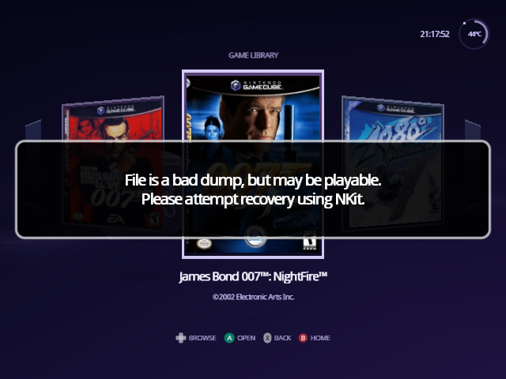

[Indigo guide](README.md) › Troubleshooting

# Troubleshooting

- [I see Swiss's file list instead of the Library](#i-see-swisss-file-list-instead-of-the-library)
- [Home starts on Source, or Library says Select Source](#home-starts-on-source-or-library-says-select-source)
- [Some games have no box art](#some-games-have-no-box-art)
- [A message says the file is a bad dump](#a-message-says-the-file-is-a-bad-dump)
- [The screen went dark after I changed a video mode](#the-screen-went-dark-after-i-changed-a-video-mode)
- [A game's picture is stretched, shifted or wrong](#a-games-picture-is-stretched-shifted-or-wrong)
- [My settings don't stick](#my-settings-dont-stick)
- [My cheats don't show up, or don't work](#my-cheats-dont-show-up-or-dont-work)
- [In-Game Reset takes me to stock Swiss](#in-game-reset-takes-me-to-stock-swiss)
- [The same game opens every time Indigo starts](#the-same-game-opens-every-time-indigo-starts)
- [Still stuck](#still-stuck)

## I see Swiss's file list instead of the Library

  

The Library appears only when `/games` holds nothing but games: disc images
(`.iso`, `.gcm`, `.tgc`, `.fdi`) or folders with one in each. A single other
file, such as a text file or cover image, or an empty folder, brings back the
file list. Remove it, or turn on **Hide unknown file types** in Settings ›
Setup › Library. See [Set up the games folder](library.md#set-up-the-games-folder).

## Home starts on Source, or Library says Select Source

Indigo didn't find a device to read games from when it started. Check that
the SD card or drive is seated, then choose it on the Source face: see
[Change the source](source.md#change-the-source). In the source picker, **Z**
also lists the devices that weren't detected, and A on one tries again.

## Some games have no box art

A game shows its banner card when its game ID isn't in your poster pack:
it's from the other region, or GameTDB has no cover for it. The card shows
the ID, so you can check. Use the pack for the region most of your games are
from, or [build your own](posters.md#build-your-own-pack).

## A message says the file is a bad dump

  

Swiss knows the exact size of each GameCube disc. "File is a bad dump, but may
be playable" means your image is a different size, so something is probably
missing or damaged. It shows for five seconds, then the game opens anyway.
"File is a bad dump and is not playable" stops the game from opening. Try
NKit's recovery, as the message suggests, or make a fresh copy of the disc.
[Verify](game-details.md#verify) (R on game details) checks an image's data.

## The screen went dark after I changed a video mode

Wait ten seconds. After a change to **Swiss Video Mode**, **System Video**,
**AVE Compatibility**, **Force DTV Status** or **RetroTINK-4K HDMI Input**,
Indigo puts the old mode back by itself unless you press A to keep it. See
[Video changes ask first](settings.md#video-changes-ask-first).

If a game starts in a mode your TV can't show, open the game's details, press
X, highlight **Force Video Mode** and press X to put it back to the default.

## A game's picture is stretched, shifted or wrong

Look at the game's own settings (X on its details) for anything marked
**Custom**: **Force Widescreen**, **Force Horizontal Scale** and **Force
Vertical Offset** change the picture. X puts a setting back to Game Defaults.
If every game looks wrong, check Settings › Game Defaults instead.

## My settings don't stick

Open Settings › Setup › Storage and read the line under the title:

- **"No device to save settings to."** Indigo found nowhere to save. Check
  your SD card, then set **Configuration Device** and leave with Save &
  Exit.
- **"No swiss/settings/global.ini yet: using defaults."** There's no file
  yet, or it couldn't be read. Leaving Settings with B or Save & Exit
  writes one.
- **"Settings are saved in swiss/settings/global.ini."** Saving works. If a
  setting you typed into the file on a computer is ignored, check its spelling
  against [Settings files](../SETTINGS.md): keys and values are
  case-sensitive, and only `Yes` turns a setting on.

Leaving with **Discard & Exit** throws away the changes you made.

## My cheats don't show up, or don't work

- **"No cheats found" on game details:** the file must be
  `/swiss/cheats/<game ID>.txt`, named with the six-character ID exactly.
  The [cheat pack](cheats.md#get-cheat-files) has them for every region.
- **The cheats don't apply:** cheats apply when you open the cheat browser
  before starting the game. To have them apply every time, turn on
  **Auto-load cheats** in Settings › Quick.
- **"Not enough room. Turn off another cheat first.":** the cheats that are on
  have filled the space for cheats. Switch some off; Z in the browser shows
  how much is used.

## In-Game Reset takes me to stock Swiss

With In-Game Reset set to **Apploader**, a reset returns to the Swiss inside
`/swiss/patches/apploader.img`, not to Indigo. Set it to **Reboot** in
Settings › Quick to reset the console instead, which brings you back to
Indigo when your loader boots it.

## The same game opens every time Indigo starts

That game is set to Autoload. Press B to go to the Library, open the game
again and press **Z**: the shortcut changes from "Autoload On" back to
"Autoload".

## Still stuck

- Questions: [Discussions](https://github.com/spencercnorton/indigo/discussions).
- Bugs: [open an issue](https://github.com/spencercnorton/indigo/issues/new/choose),
  with your Indigo version (System › System Information › About Indigo),
  your loader and what you pressed.
- Report problems with Indigo here, not to the Swiss project: Indigo is an
  unofficial fork.

---

<a href="posters.md">← Posters</a> · <a href="README.md">Guide</a>

